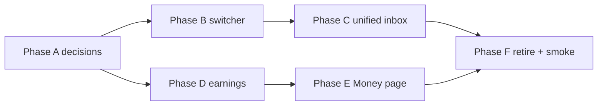

# Talent Tulala Dashboard — Phase 2.2 → 2.6

**North star:** One talent identity. Many agency relationships. Tulala = the dashboard.

## Documents (read before each phase)

| Doc | Path |
|---|---|
| Master plan | [docs/plans/talent-tulala-dashboard-execution-plan-2026-05-25.md](../docs/plans/talent-tulala-dashboard-execution-plan-2026-05-25.md) |
| Agent rules | [docs/plans/agent-prompts/_preamble.md](../docs/plans/agent-prompts/_preamble.md) |
| Operator guide | [docs/plans/agent-prompts/README.md](../docs/plans/agent-prompts/README.md) |
| Terminal runner (backup) | `node scripts/agent/run-phase.mjs <a\|b\|c\|d\|e\|f>` |

## Decisions (locked 2026-05-25)

- Nav label for earnings: **Money** (not Agencies).
- Commission display: derive realized rate from `booking_commission_snapshot` (not per-roster column).
- Manual off-platform earnings: v2 (not in this plan).
- **Talent Money ≠ Admin Business Financials** — separate surfaces; admin financials is out of scope (master plan §15).

## Phase dependencies

- **C and D** can run in parallel after B.
- **E** requires D.
- **F** requires B + C + D + E.

## Per-phase agent instructions

Before editing code for any phase:

1. Read [\_preamble.md](../docs/plans/agent-prompts/_preamble.md).
2. Read the phase prompt (`phase-a.md` … `phase-f.md`).
3. Read the matching section of the master plan.
4. Run `cd web && npm run typecheck` before and after.
5. If touching RLS / tenant scope: `npm run test:tenant-isolation`.

| Phase | Prompt | Master plan |
|---|---|---|
| A | [phase-a.md](../docs/plans/agent-prompts/phase-a.md) | §4 |
| B | [phase-b.md](../docs/plans/agent-prompts/phase-b.md) | §5 |
| C | [phase-c.md](../docs/plans/agent-prompts/phase-c.md) | §6 |
| D | [phase-d.md](../docs/plans/agent-prompts/phase-d.md) | §7 |
| E | [phase-e.md](../docs/plans/agent-prompts/phase-e.md) | §8 |
| F | [phase-f.md](../docs/plans/agent-prompts/phase-f.md) | §9 |

## Out of scope

- Admin **Business Financials** page (agency revenue lane) — separate future plan.
- Per-roster commission override column — only if a customer asks.
- Multi-currency, tax docs, hub directory apply flow.

## QA accounts

- `qa-talent-dashboard-audit@impronta.test` / `Impronta-QA-Talent-2026!` — Impronta + Morena Studio (2 agencies).
- Profile code: `TAL-AUDIT-0512`.

## Definition of done (whole plan)

1. Pure talent never sees agency-context switcher.
2. Today / Messages / Calendar unified across agencies with filter chips.
3. `/talent/money` live; `/talent/agencies` redirects.
4. Real YTD from `booking_commission_snapshot`.
5. L41–L43 in `docs/decision-log.md`.
6. `npm run ci` green.
