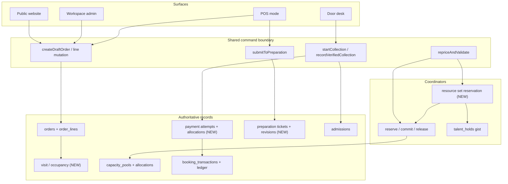

# Tulala Execution Program: 48 Journeys to End-to-End

Revised against two rounds of review. QA is now woven through every project as a standing workstream rather than a phase, with a tiered coverage model that reaches all 48 cases without pretending to hand-run two hundred browser journeys.

## 1. Executive assessment

**You are not missing a commerce platform. You are missing the operational layer over the one you have, plus the structured business states that roughly half the case studies actually run on.**

On `origin/main` there is a single row-locked capacity engine, a unified `createPurchase` pipeline that events, menu and reservations all call, a unified `talent_offerings` catalog with two owner kinds, an `admissions` table with single-use door check-in, seller-owned promo codes with authoritative redemption under a row lock, per-line refunds that void the ticket and release the seat atomically, a three-lane commission engine, and about 1,231 test files behind a roughly 40-lane CI gate.

What is missing splits into two halves:

- **The operating layer.** No register, shift, open check, tab, kitchen routing or terminal. Nine of the twenty-three navigation destinations in the product document do not exist.
- **Structured business states.** Deliverables and approvals, recurring agreements, service areas and travel, accepted quote versions with agreed changes, departures with meeting points and manifests, service phases within an appointment, and hybrid packages whose components have separate availability and cancellation. Around twenty-five of the forty-eight cases need at least one of these, and none of them exist.

**And a third thing, which the QA requirement surfaced: there is no way to put a business into a testable state.** Production carries zero events, zero sessions, zero orders and zero admissions. The existing QA README already diagnosed this and named the consequence plainly — "almost every row on the QA list needs an object that does not exist," and "it is not a seed script anyone has written." That makes the fixture harness (P0-06) critical path for the entire QA program, not a convenience.

## 2. Reading and evidence register

**Audited revision: `749737206b6d8890442ab98a325f46d5873b7837`.** `origin/main` and `origin/production` are both at this SHA, the exact commit the product document pinned. Nothing has merged since.

Product requirements, read in full and committed as P0-01: `Tulala-Business-Journeys-POS.md` (2,538 lines) and `Business-specific-labels-Workspace-Theme.md` (595 lines).

Repository evidence from eight parallel investigations reading `origin/main` directly, because the local checkout is 442 commits behind: [events and ticketing](cd3413aa-5fc2-4c3e-89ed-253c582c16b6), [capacity, sessions, reservations and spaces](c97f0fc5-4827-49f5-bd5e-e57dde1429ad), [payments and money](d5975bb8-73de-43fb-b62f-34d7824c234a), [presets, labels and entitlements](a8868db6-334b-4ff1-84d6-9e17c2392cb9), [orders, catalog and POS surfaces](6206975c-e6ec-4d19-a0f9-17e192ca7fc8), [API, jobs and observability](f8edbc31-88bc-4629-854f-3dc2d0cc5c5b), [identity, tenancy and navigation](7dcc8d8e-8ec6-4875-a200-39eb8f84eb34), [release truth and claimed gaps](dbcf09c0-354b-4168-8bcf-36be02c15523).

**Instruction conflicts to fix, not work around.** The `AGENTS.md` in the local workspace rules says trunk is `stable-work`; the one on `origin/main` says `main`, and `stable-work` is retired. `CLAUDE.md` and the workspace rules point at `web/src/middleware.ts`, which **does not exist** — edge routing is `web/src/proxy.ts` with the allow-list in `web/src/lib/saas/gate.ts`. `OPERATING.md` sections 3 and 6 describe the retired deploy ladder. `web/docs/migration-auto-apply.md` documents a workflow deleted in `22a9e8af0`. The Playwright config header says Playwright must be installed; it is already in `devDependencies` at `^1.59.1`.

## 3. Current-state corrections

**Confirmed.** Mercado Pago does not exist anywhere — all 46 `mercado` matches are Spanish marketing copy plus two comments reserving `'mercado_pago'` as a future enum value. The preset registry holds exactly 20 snake_case IDs, aligning with neither the 120 kebab-case type IDs nor the 12 families. No promo input in the guest picker. Print export returns 501 because `getPrintDesignExtractor()` returns `null`. Sessions DST collisions reach only `improntaLog`. No POS anything. No public API.

**Corrected.** Pay-at-door *is* implemented in the guest picker with a hold running to session end; the file's own "CARD ONLY" header is stale. Discounts are far stronger than "PARTIAL" — `redeem_tenant_promo` re-counts under `FOR UPDATE`, seven customer-facing refusal reasons exist including event and tier scoping, and the seller-versus-Tulala separation the audit asks for already exists as three distinct schema families. `admissions` exists. The events segment is URL-reachable with only the rail gated.

**Two defects.** A paid order can end with no seat: `complete-order.test.ts` currently *asserts* that hold-expired plus payment-succeeded yields `paid` with `committed: 0`, and only the ticket path has compensation. And `sweepExpiredOrders` is named in a comment and does not exist.

**One correction to my own draft.** The 200-parallel-reserve proof **does exist** — `web/scripts/verify-capacity-concurrency.mjs`, run as `npm run verify:capacity-concurrency`. It already reads ground truth from `capacity_allocations` rather than tallying HTTP replies, because under 200 parallel sockets some requests die client-side and a reply tally cannot distinguish that from a refusal. It is excluded from `ci` deliberately so `check:ci-lane-parity` stays truthful. **Its header records that it was run against production, and its npm script hardcodes `--env-file=.env.vercel.local`.** There is no isolated test database in this repo.

## 4. The five shared contracts (P0-04, settled before implementation)

All five land in `docs/decision-log.md` continuing from L51.

### 4.1 Visit, order, payment, allocation, preparation

**The existing `orders` row is the commercial record.** No parallel "check" entity.

- **Visit / occupancy** — who is being served, where, during which visit. New lightweight record keyed to a space. Owns table state and reset.
- **Order** — items, adjustments, commercial balance. The existing `orders` row, extended with operational fields. `orders.space_id` exists today as an unused placeholder and becomes the visit link.
- **Payment attempt** — one attempt to collect money. An attempt can be pending, declined or unknown without the order changing.
- **Payment allocation** — how confirmed money applies to an order. Deposits, partial settlement and split payment all mean one order has several allocations, and one payment can span orders.
- **Preparation ticket** — what a station was instructed to prepare. Separate lifecycle, never derived from payment state.

A separate service-visit record spanning multiple orders arrives **only if** a case proves one visit needs several orders — bill-splitting is the likely trigger, deferred until built rather than designed speculatively.

### 4.2 The command contract

POS does not call `createPurchase` per button press. A waiter adding a drink must not re-run customer creation, re-consume a promotion, or create a second capacity hold. Seven commands, extracted from existing functions at their current boundaries:

`createDraftOrder` · `addLine` / `updateLine` / `removeLine` · `repriceAndValidate` · `submitToPreparation` · `startCollection` · `recordVerifiedCollection` · `finalizeOrCancel`

Promotion resolution and capacity holds attach to `repriceAndValidate` and `startCollection`, never to line mutation. **Extract only the boundaries the current work touches.**

### 4.3 Resource coordination

`talent_holds` stays separate from capacity pools. One transactional command reserves a set — therapist A, therapist B, the treatment room, buffers — across both tables, all-or-nothing, with a **consistent lock order** (the capacity engine already locks root-first via `FOR UPDATE OF p`; the coordinator adopts the same discipline across both stores) and bounded retry on deadlock. Also defined: temporary hold versus confirmed booking, whole-set reschedule and cancellation, cross-business availability, resource substitution, and cross-workspace privacy. **No person-capacity migration required.**

### 4.4 Refund effects

Money refunded and service cancelled are related decisions, not one action. Five supported effects, deliberately a small set rather than a policy editor: refund part of the price keeping the entitlement · cancel one ticket from a multi-ticket order, revoking that admission and releasing that seat · refund after service as an adjustment · revoke an unused admission, refund optional · refund one component of a hybrid package, others standing. The UI states the effect before confirmation.

### 4.5 Theme layers

Four independent things: **business type** (one primary, several secondary activities) · **vocabulary** (manual override → type preset → family preset → canonical localised default) · **enabled capabilities** (real server-side gates) · **operational starting view** (presentation only). **Roster is not hidden because a business is solo** — visibility follows enabled capabilities and relationships.

## 5. Definition of done

Three levels, none of them an approval gate. A task advances when its own evidence exists; nothing waits on a human unless the evidence genuinely requires one.

**A task is done when** its behaviour is implemented and connected to the running application; focused tests and required checks pass or every failure is classified; permissions are enforced server-side; its user flow has been exercised through the real interface or added to the active browser audit; and evidence plus remaining limitations are recorded.

**A case is done when** every required customer, operator and applicable talent step works; the documented difficult combination works; required pages, actions and integrations are connected; data survives refresh, sign-out and reopening; money, capacity, booking and fulfilment states stay consistent; failure and recovery scenarios pass; and no unresolved defect stops the business operating.

**A release is ready when** its cases satisfy the above; deployment, configuration and migration checks pass; shared-flow regression passes; provider and device verification is complete or explicitly marked awaiting; and post-deploy smoke passes.

A merged PR, a green lane or a screenshot proves none of this on its own. But a failure that does not block a business is logged, classified and left behind while unrelated work continues.

**Nine statuses**, tracked per task and per case scenario in the ledger: not started · implementing · in active audit · implemented, awaiting focused verification · QA failed · blocked by defect · awaiting external verification · verified in test environment · release verified.

## 6. QA runs on the existing structure, extended

There is already a good QA system here and the plan extends it rather than competing with it.

- **Scenario records live in the case files** (`docs/plans/program/cases/`), one block per scenario, carrying the full field set: scenario ID, case, environment and config, role, fixture and initial conditions, steps, expected visible result, expected persisted result, negative and recovery cases, automated-or-manual, evidence location, what failure blocks completion, severity and disposition. Because the case file already holds the customer, operator and difficult-combination journeys, this adds no second layer.
- **Human-only rows append to `docs/plans/qa/<area>.md`** in the established `| what to do | proves | falsified by |` form, referencing scenario IDs. Not to `phase-boundary-qa.md` — that file is a shared append point that conflicts every open PR, which its own header documents.
- **Evidence lands in `qa-evidence/<scenario-id>/`**, matching the existing `playwright-summary.json` and `browser-summary.json` convention already used by `T2`, `T3`, `T4` and `phase-5-launch-gate-20260527`.
- **Browser journeys are Playwright specs in `web/e2e/`**, run through the existing `test:e2e:*` script pattern and `gate-queue.sh`.
- **Defects:** blocking and high-risk open a GitHub issue, the mechanism this repo already uses for red main, linked from the ledger. Normal and cosmetic append to one `docs/plans/program/defects.md`. One log, no tracker.

The existing rules carry over because they are already right: mark a row `BLOCKED:` and say what by, since a blocked row costs nothing and a row that reads executable but is not costs the one resource nobody can substitute for; and re-check a blocker before trusting it.

### Two harness gaps to close first

**P0-06 — the case fixture harness.** The single item blocking all 48 browser journeys. It provisions a tenant with business type, enabled capabilities, staff and roles, services or menu items, spaces and stations, sessions or events, and sellable limits — so a journey starts from a realistic state. Precedent exists to follow rather than invent: `supabase/seed_phase5_qa.sql`, `scripts/seed-staging-host.mjs`, and the `qa-evidence/phase-5-launch-gate-20260527/scripts/seed-staging-*-oneshot.mjs` one-shots. Two constraints already ruled in the QA README hold: build on a real prospect tenant, not Impronta's live site, and where a builder block is the thing in doubt, place it through the builder rather than writing the row.

The division of labour is your section 4 rule: **fixtures prepare state, the browser performs the business action under test.** A booking test may seed the service and the calendar; it must book through the booking UI. Proving a customer flow by inserting rows or calling internal functions does not count.

**P0-07 — device projects.** `playwright.config.ts` defines exactly two projects, `chromium`/`google-chrome` and `webkit`, both desktop. Tablet POS and mobile checkout have no project. Add tablet and mobile device projects, and scaffold the case-journey spec pattern so each case adds a file rather than a bespoke harness. Auth is already solved — `/api/dev/signin`, `/api/dev/preview-qa-signin` and `PLAYWRIGHT_USE_DEV_SIGNIN=1` exist.

### Tiered coverage: how 48 cases get real browser proof

48 cases times customer, operator, talent, difficult combination and recovery is over two hundred scenarios. Hand-running that is not affordable, and claiming to have done it would be worse. Your section 4 gives the resolution — representative cases first to expose shared-engine defects, then reuse the coverage — so coverage is tiered:

**Ten representative cases get the complete browser journey** on every surface, chosen so their shared engines span all 48: **1 Nail salon** (appointment, deposit, paired resource) · **6 Restaurant** (tables, QR, preparation, open check, split) · **9 Yoga studio** (recurrence, capacity, walk-in, attendance) · **12 Event venue** (tickets, door, private hire, performer) · **8 Modelling agency** (inquiry to booking, multi-talent, commission) · **26 Frozen pizza** (takeaway, sellable limit, pickup window) · **31 Private chef** (mobile, service area, travel, agreed menu) · **27 Laura's agency** (deliverables, approvals, milestones, recurring) · **24 Escape room** (hybrid package, partial cancellation) · **13 Coworking hybrid** (multiple capabilities over shared space).

**The remaining 38 get a browser-verified delta** — their distinct behaviour driven through the real interface over a shared fixture, with the engine paths they inherit already proven by their representative. A case is not marked verified on inheritance alone; it is marked verified when its own documented difficult combination has been executed.

## 7. Project sequence and the standing audit

One dependency-based order. Vertical bars mark projects that run concurrently because their files, schemas and dependencies do not overlap.

- **P0 — Coverage, contracts and harness.** Case files, five contracts, fixture harness, device projects. 2 cycles.
- **P1 — Event and money correctness** ∥ **P2 — Business type, vocabulary, capabilities, navigation, Sales.** No file overlap: P1 is orders, events and capacity; P2 is words, shell and navigation. 3 and 4 cycles.
- **P3 — POS shell, counter and appointment journey** ∥ **P4 — Payments: collection interface, Point discovery and adapter.** 5 and 4 cycles.
- **P5 — Restaurant: checks, preparation, takeaway, table QR.** Depends on P3's command boundary. 5 cycles.
- **P6 — Multi-resource scheduling and spaces** ∥ **P7 — Service-business operating states.** 4 and 4 cycles.
- **P8 — Hybrids and remaining combinations.** Depends on P2, P5, P6, P7. 3 cycles.
- **P9 — Integration platform.** A separate milestone, explicitly outstanding when the case milestone completes.

**W-AUDIT is a standing workstream, not a phase.** From P0 onward it runs continuously and concurrently with every project: full browser audit of what exists today, full code and repository audit, permission and security checks, payment and concurrency integration tests, case journeys as their fixtures land, regression on affected shared systems, and evidence capture. It is where audit-discovered defects get fixed, and it never blocks a project — nor does a project block it.

Each project closes by moving its cases forward in the ledger with evidence. Case validation is continuous from P0; there is no final QA phase.

Roughly 30 execution cycles for P0 through P8, where a cycle is one long agent session ending at a durable checkpoint.

```mermaid
gantt
  dateFormat X
  axisFormat %s
  section Continuous
  W-AUDIT browser code permissions evidence :0, 30
  section Projects
  P0 coverage contracts harness :0, 2
  P1 event and money correctness :2, 5
  P2 type vocabulary navigation :2, 6
  P3 POS shell and first journey :6, 11
  P4 collection interface and Point :6, 10
  P5 restaurant checks and preparation :11, 16
  P6 multi-resource scheduling :16, 20
  P7 service-business states :16, 20
  P8 hybrids and combinations :20, 23
```

## 8. What each audit area covers

**Workspace and industry theme.** Every enabled navigation link reaches a working page; direct URLs, refresh, back and deep links work; labels fit the selected type; switching type preserves records, permissions and overrides; hybrids enable several activities; **hidden modules cannot be reached by direct URL or API without authorization**; search, filters, empty states and actionable errors work; Sales links to the correct underlying record; free bookings do not read as unpaid or failed; roster assignment stays distinct from staff access. Registry completeness is validated automatically across all 120 types; render-testing covers each distinct preset family plus meaningful hybrids, not 120 identical renders.

**POS.** The full loop — open, start or select a sale, add items, apply eligible adjustments, collect, receipt, next customer — on each distinct layout: counter, appointments, table service, admissions, office collection. Correct workspace, location and operator context; existing appointment or order opens correctly; walk-in selling without forced customer registration; quantities, modifiers, extras and removals calculate correctly; **a previously paid deposit credits exactly once**; pending, failed, cancelled and confirmed states display accurately; reload and leave preserve saved work; Back to Workspace does not close a shift; two operators cannot silently overwrite each other; unauthorized discount, refund and cash actions are refused server-side; **repeated clicks and retries do not duplicate a sale, a collection or a preparation ticket**; cash tender, change and shift totals reconcile; receipts match the transaction.

**Scheduling, resources and capacity.** Real-database integration tests for concurrency plus browser tests for the operator experience: two customers on the last place; repeated creation of the same event session; several workers sharing one room or station; overlapping appointments; setup, cleanup and travel buffers; recurrence, timezone and DST boundaries; expired holds; rescheduling with live commitments; cancellation and release; alternate layouts over one physical capacity; one professional across businesses and privately. For simultaneous requests the assertion is **no oversell, no duplicate commitment, no leaked hold** — with retryable errors classified separately from genuine sold-out refusals, because demanding one refusal reason makes a correct system look broken.

**Payments, discounts and recovery.** Provider test environments throughout: success, decline, cancel, pending; timeout followed by late success; duplicate and out-of-order notifications; deposit plus balance; multiple allocations; full and partial refunds; refund failure and retry; **payment succeeds but capacity cannot be granted**; complimentary purchase; promotion expiry, eligibility and usage limits; concurrent final redemption; discount removal and repricing; imported transactions and unmatched reconciliation; repeated import and webhook delivery without duplicate records. Both the customer-visible outcome and the underlying allocations, refunds and entitlements are verified. **A unique admission constraint does not prove financial settlement is idempotent** — payment recording, allocation and admission issuance are tested independently. No fake success screen ever substitutes for provider verification.

**Restaurant, takeaway, preparation.** Website, QR and POS honour the same catalog rules; **a table QR cannot expose a previous guest's order**; new items reach the right station; amendments are distinguishable from new orders; retry and reconnect do not duplicate preparation; cancelled items stay understandable to staff; item and order readiness behave correctly; table moves preserve ownership and balances; scheduled pickup respects lead time and window capacity; ready notification and handoff work. Payment status stays separate from preparation status.

**Agency, talent and hybrid.** Inquiry to offer to acceptance to booking; accepted pricing and terms remain identifiable after amendment; assignments reach the right professionals; private customer information stays isolated; deliverables, approvals and milestones work; recurring occurrences and billing stay distinguishable; mobile services retain address and travel; hybrid packages reserve every required component; cancelling or refunding one component has the intended effect on the others; commissions and payouts follow the applicable seller arrangement.

**Browser and usability.** Desktop workspace, tablet POS, mobile customer checkout, mobile operator and talent flows. Navigation and broken links; scrolling and overflow; forms, validation and error recovery; keyboard access, focus and understandable control labels; touch targets; sticky controls and on-screen keyboard interference; loading, empty and failure states; EN/ES labels and currency and date formatting. Defects that block or confuse real use get fixed; cosmetic issues are logged and left. Screenshots are evidence; assertions and business records are proof.

**Permissions.** At least two workspaces and representative customer, talent, cashier, staff and owner roles. A user cannot read or mutate another workspace's records; **changing a record ID in a request does not bypass authorization**; a public receipt or QR reveals only what it should; staff cannot perform owner-only operations; business-type selection grants neither paid capabilities nor broader access. Synthetic data only; no credentials or customer information in reports. The repo already has `test:tenant-isolation` and `tenant-isolation.security.test.ts` to build on.

## 9. Triage: what stops, what does not

**On finding a defect:** classify blocking / high-risk / normal / cosmetic; fix blocking and high-risk inside the active workstream; continue unrelated implementation and audit in parallel; re-run the focused tests first; widen to regression only when shared behaviour changed; record and move on. No approval phase.

**Do not stop the program for** a cosmetic issue, a non-blocking documentation gap, a scenario already covered by an equivalent shared-engine test, an unavailable device or provider action, or a defect isolated to an unrelated workstream.

**Do stop and escalate the affected flow for** unauthorized data access or mutation, a duplicate charge, refund, booking, order or entitlement, oversell or incorrect allocation, a broken core customer or operator journey, irrecoverable data loss, or a release-blocking migration, deployment or security failure.

When a device, credential or authorized live action is missing, the scenario is marked **awaiting external verification** and independent work continues. It is never marked passed.

**Gate sizing.** Focused lane during development, affected browser journey next, repository-required gates at the integration boundary — not after every text edit. The `ci` aggregate is roughly 40 lanes ending in `lint && build`; running it per task is not viable and the repo already knows it, which is why `gate-queue.sh` and `tsc-queue.sh` serialise gates and the board records a full stop-work at 4 MB free RAM. A background task reporting `exit code 0` is not evidence — the real exit code must be echoed from inside the command, because five recorded cases had a wrapper's trailing `echo` mask a signal death. Shared regression runs when money, capacity, identity, order or permission behaviour changes.

## 10. All-48 coverage matrix

Each case: what works today, what business behaviour is missing, the tasks required, and two completion states. **Basic** means the primary transaction works. **Complete** means customer, operator and documented difficult combination all pass. Cases marked **[R]** are the ten representatives carrying full browser journeys.

### Appointment businesses

**1. Nail salon [R]** — Have: appointments with buffers, deposits via `checkout_type`, offering variants and add-ons. Missing: technician *and* station reserved together, bridal group as one multi-guest booking. Tasks: P2-01, P3-04, P6-01, P6-02. Basic: books a technician and takes a deposit. Complete: a bridal group of four holds four technicians and four stations atomically, and a competing booking cannot take any of them.

**2. Spa** — Have: appointments, packages, restricted preferences via capability checks. Missing: two therapists plus one room in one allocation, couples packages as a coordinated set. Tasks: P6-01, P6-02, P7-06. Basic: books a single therapist. Complete: a couples massage reserves two therapists and one room together, and a competing booking cannot take any committed resource.

**3. Independent massage therapist** — Have: solo workspace, independent seller path via `owning_party_type='talent'`. Missing: service areas modelled distinctly from bookable rooms, travel buffers, cross-workspace schedule conflict. Tasks: P6-03, P6-05, P7-03. Basic: takes a mobile booking. Complete: a home visit blocks the matching studio slot, travel time is respected, and the spa cannot see her private client list.

**4. Tattoo studio** — Have: inquiry-to-offer-to-booking, deposits, media attachments. Missing: accepted quote version with agreed changes, multi-session work as a linked series. Tasks: P7-04, P6-01. Basic: quotes and takes a deposit. Complete: a four-session piece books as one agreement with per-session deposits and one reference set.

**5. Hair salon** — Have: appointments, stylists, add-ons. Missing: processing phases inside one appointment, wash-station allocation, approved mid-service changes. Tasks: P7-06, P6-01, P3-04. Basic: books a stylist for a fixed duration. Complete: a colour service releases the chair during development and holds the wash station only for its phase.

**28. Eyelash business with five workers** — Have: multi-staff roster, appointments. Missing: five workers sharing three stations as a real constraint. Tasks: P6-01, P6-02. Basic: books any of five technicians. Complete: the fourth simultaneous booking is refused for lack of a station, not a technician.

**30. Tania: massage therapist** — Have: as case 3. Missing: as case 3, plus recurring client agreements. Tasks: P6-03, P7-02, P7-03. Basic: takes bookings at one location. Complete: a weekly recurring client generates dated occurrences that can each move or cancel without ending the agreement.

**41. Freelance makeup artist** — Have: solo seller, offerings, deposits. Missing: travel and service areas, on-location call times, multi-person bookings. Tasks: P6-03, P7-03, P6-01. Basic: books a single session. Complete: a bridal party of five books one on-location slot with travel buffer and one agreed price.

### Table service and counter

**6. Restaurant [R]** — Have: catalog, orders, capacity limits, reservations with service windows, public menu ordering. Missing: open checks, table QR with visit identity, kitchen routing, cash and shift, split settlement. Tasks: P5-01 to P5-06, P3-01, P3-02. Basic: takes a reservation and a public menu order. Complete: a guest scans a table QR, staff fire courses, the check moves tables, and the bill splits three ways.

**7. Bar** — Have: as case 6, plus events for performances. Missing: open tabs distinct from table checks, bar queue, booth reservation separate from event admission, performer fees. Tasks: P5-01, P5-04, P7-05, P1-04. Basic: sells drinks as counter sales. Complete: a tab stays open across the night, booth and gig ticket are separate records, and the performer's fee is a distinct payable.

**11. Beach club** — Have: reservations, events, orders. Missing: cabana service context, food and bar queues, explicit spending credit against a minimum. Tasks: P5-01, P5-04, P5-07, P6-02. Basic: reserves a cabana and sells tickets. Complete: a cabana minimum is consumed by orders and remaining credit is visible to guest and staff.

**25. Sushi restaurant with dine-in and takeaway** — Have: catalog, purchase, capacity, public menu. Missing: pickup timing and windows, preparation lead time, ready notification, handoff confirmation. Tasks: P5-02, P5-03, P5-08. Basic: accepts a paid online order. Complete: a customer picks a window, the kitchen prepares to it, the customer is notified, and staff confirm handoff of the right order.

**26. Jesus: frozen pizza sold from home for takeaway [R]** — Have: catalog, purchase, and `offering_stock` as a real sellable-units limit. Missing: per-window order caps, availability scope by date or batch, ready notification. Tasks: P5-08, P2-02, P0-04. Basic: sells a fixed quantity. Complete: "twenty pizzas for Friday pickup" sells out for Friday only, Saturday is unaffected, and a cancellation returns a unit to Friday's pool.

### Class and session businesses

**9. Yoga or fitness studio [R]** — Have: session series, materialiser, tier pools, capacity. Missing: registrations in Sales, attendance separate from payment, walk-in admission from POS. Waitlist deferred. Tasks: P2-04, P3-05, P6-04. Basic: publishes a recurring class and sells places. Complete: a walk-in buys at the door against the same pool, attendance is marked without a payment event, and a free place is not shown as overdue.

**39. Private language tutor** — Have: appointments, offerings. Missing: recurring agreements, lesson packages drawn down over time. Tasks: P7-02, P7-04. Basic: books single lessons. Complete: a ten-lesson package decrements as lessons are delivered and its unused balance refunds under the stated rule.

**40. Independent personal trainer** — Have: appointments, solo seller. Missing: recurring agreements, session packages, class-and-appointment mix. Tasks: P7-02, P2-02, P6-04. Basic: books one-to-one sessions. Complete: a client on a weekly agreement also joins a group class, each drawing from the correct arrangement.

**44. Independent yoga instructor** — Have: sessions, solo seller. Missing: teaching at a venue she does not own, class packages. Tasks: P7-02, P6-03, P2-02. Basic: runs her own classes. Complete: a class hosted at a partner studio does not falsely claim that studio's capacity.

### Event and admission businesses

**12. Event venue [R]** — Have: events, tiers, admissions, door check-in, space hire through reservations. Missing: private-hire quoting, performer assignment and fees, layout-aware capacity, organiser-versus-guest payer. Tasks: P1-04, P1-05, P6-02, P7-05, P2-04. Basic: sells tickets to a public event. Complete: a private hire is quoted and invoiced to an organiser, a performer is assigned and paid, and a second layout cannot create capacity the room lacks.

**20. Art gallery with workshops, exhibition admission and private hire** — Have: events and admissions. Missing: workshops as classes, private hire as space booking, all three sharing one room's capacity. Tasks: P6-02, P8-01, P2-02. Basic: sells exhibition admission. Complete: workshop, private hire and open admission cannot double-book the same room on the same evening.

**38. Independent DJ** — Have: talent profile, inquiry-to-offer-to-booking, commission. Missing: equipment and setup time in the booked duration, negotiated terms, cross-venue availability. Tasks: P7-05, P6-03, P6-01. Basic: receives and accepts a booking. Complete: a four-hour set books six hours of calendar, and a second venue cannot book the overlap.

**47. Independent musician** — Have: as case 38. Missing: as case 38, plus selling tickets to his own show at someone else's venue. Tasks: P7-05, P6-03, P1-04. Basic: takes a booking. Complete: he sells tickets to a gig at a venue he does not own without claiming that venue's capacity.

**48. Independent event host or MC** — Have: as case 38. Missing: setup and travel, multi-event days, negotiated terms. Tasks: P7-05, P6-03, P7-03. Basic: takes a booking. Complete: two events in one day are refused if travel between them does not fit.

### Agency and representation

**8. Modelling or talent agency [R]** — Have: inquiries, offers, bookings, three-lane commission, owning-party resolution, multi-talent participants, roster. Missing: Sales defaulting to Bookings, deliverable and usage terms, call sheets on the booking. Tasks: P2-04, P7-01. Basic: runs inquiry to booking with commission. Complete: a three-model shoot books all three atomically, usage terms are recorded, and each fee and the agency margin are separately visible.

**10. Photography studio** — Have: offerings, packages, inquiries, deposits. Missing: several professionals and a studio reserved simultaneously, overtime validation, proposal versions. Tasks: P6-01, P7-01, P7-04. Basic: books a headshot appointment. Complete: a shoot reserves photographer, assistant and studio together, and overtime repricing needs explicit approval.

**27. Laura: social media agency for local businesses [R]** — Have: inquiries, offers, bookings, recurring-capable billing primitives. Missing: deliverables with approval and revision status, due dates, payment milestones, advertising budget kept distinct from service fees. Tasks: P7-01, P7-02. Basic: converts an inquiry into a retainer booking. Complete: the client approves a deliverable, revisions track against a limit, and service charges stay distinguishable from advertising funds passed through.

**34. Evy Solutions: provisional service profile** — Have: talent profile claim flow, provisional profiles, roster invitation. Missing: what a provisional profile may sell before claim. Tasks: P7-01, P2-02. Basic: a provisional profile exists and is discoverable. Complete: it cannot take money or publish terms until claimed, and claiming preserves its history.

### Solo, mobile and field-service professionals

**29. Alejandra: immigration solutions** — Have: inquiries, offers, documents through media. Missing: case milestones with payment stages, document request and approval states. Tasks: P7-01, P7-04. Basic: quotes and invoices. Complete: a multi-stage case bills per milestone and the client sees which documents are outstanding.

**31. Chris: private chef [R]** — Have: offerings, inquiries, deposits. Missing: service area, visit address, travel buffer, menu agreed per event, occasional assistants. Tasks: P7-03, P7-04, P6-01. Basic: takes a booking with a deposit. Complete: a dinner for twelve at a client address records the agreed menu, blocks travel time, and assigns an assistant.

**32. Independent house cleaner** — Have: appointments, solo seller. Missing: recurring agreement, visit address, travel, arrival and completion. Tasks: P7-02, P7-03. Basic: books single cleans. Complete: a fortnightly agreement generates visits that can each be skipped without ending the agreement.

**33. Fabian: handyman** — Have: inquiries, quotes. Missing: quote version acceptance, agreed variations, materials versus labour, deposit and balance. Tasks: P7-04, P7-03. Basic: quotes a job. Complete: an on-site variation is agreed, repriced and reflected in the balance without rewriting the original quote.

**35. Idan: private tours** — Have: sessions and capacity, offerings. Missing: departure with meeting point, participant manifest, guide and vehicle capacity, attendance. Tasks: P7-05, P6-02, P6-04. Basic: sells places on a dated tour. Complete: a departure shows a manifest, refuses the ninth passenger on an eight-seat vehicle, and marks attendance at the meeting point.

**36. Zvika: custom jewelry** — Have: inquiries, offerings, deposits, product fulfilment states. Missing: accepted design version, agreed changes, deposit and balance, delivery or pickup handoff. Tasks: P7-04, P5-08. Basic: quotes a commission. Complete: a design change is agreed and repriced, the balance is collected before release, and pickup is confirmed.

**37. Independent portrait photographer** — Have: appointments, packages, media. Missing: gallery delivery and selection, print add-ons after the session. Tasks: P7-01, P7-04. Basic: books and takes payment for a session. Complete: the client selects images from a delivered gallery and buys prints against the same record.

**42. Freelance translator** — Have: inquiries, offers. Missing: deliverables with due dates, unit pricing, revision rounds. Tasks: P7-01, P7-04. Basic: quotes and invoices. Complete: a document is delivered, one revision round is tracked, and the second is chargeable.

**43. Independent dog walker** — Have: appointments. Missing: recurring agreement, service area, multi-client group walks. Tasks: P7-02, P7-03, P6-01. Basic: books single walks. Complete: a group walk holds slots for four dogs from four clients and respects the area boundary.

**45. Voice-over artist** — Have: inquiries, offers, media delivery. Missing: usage terms, revision rounds, delivery acceptance. Tasks: P7-01, P7-04. Basic: quotes and delivers. Complete: usage scope is recorded on the booking and a re-record beyond the agreed rounds is chargeable.

**46. Mobile car-detailing professional** — Have: appointments, solo seller. Missing: service area, visit address, travel buffer, on-site upsell. Tasks: P7-03, P3-04. Basic: books an appointment. Complete: an on-site upgrade is added to the existing order and collected on the spot without creating a second booking.

### Hybrids

**13. Coworking space with a cafe, meeting rooms and evening workshops [R]** — Have: reservations, spaces, sessions, catalog. Missing: three capabilities in one workspace with separate availability, counter sale, room booking, workshop registration. Tasks: P2-02, P8-01, P5-01, P6-02. Basic: books a meeting room. Complete: a café counter sale, a room booking and a workshop place coexist without the café consuming room capacity.

**14. Beauty academy with supervised salon services and public demonstrations** — Have: sessions, appointments, events. Missing: student-delivered service at a reduced price under supervision, demo admission. Tasks: P8-01, P6-01, P2-02. Basic: enrols students. Complete: a supervised service books a student *and* a supervisor *and* a station, priced as a training service.

**15. Cooking school with private catering and a pop-up dinner** — Have: sessions, inquiries, events. Missing: three commercial modes over one kitchen's availability. Tasks: P8-01, P6-02, P7-04. Basic: sells class places. Complete: a private catering booking blocks the kitchen for a pop-up dinner the same evening.

**16. Diving school with lessons, boat departures and private coaching** — Have: sessions, appointments. Missing: departures with vehicle capacity and manifest, certification prerequisites, weather cancellation. Tasks: P7-05, P6-02, P8-01. Basic: sells lesson places. Complete: a departure caps at vessel capacity and a cancelled departure releases and refunds as one action.

**17. Padel club with coaching, tournaments and a cafe** — Have: reservations, sessions, catalog. Missing: court booking, tournament as a series, café counter sale. Tasks: P6-02, P8-01, P5-01. Basic: books a court. Complete: a tournament reserves all courts for its window and the café keeps selling.

**18. Podcast studio with room hire, engineering lessons and live audiences** — Have: reservations, sessions, events. Missing: three modes over one room, engineer as a required co-resource. Tasks: P6-01, P6-02, P8-01. Basic: hires the room. Complete: a live-audience recording holds room, engineer and audience seats together.

**19. Pet grooming salon with training classes and adoption events** — Have: appointments, sessions, events. Missing: three capabilities in one workspace, event admission alongside appointments. Tasks: P2-02, P8-01, P6-01. Basic: books grooming appointments. Complete: a Saturday adoption event does not block grooming appointments in a different room.

**21. Wellness retreat organiser with multi-day classes and optional treatments** — Have: sessions, appointments, packages. Missing: multi-day package with per-day components, optional add-ons with their own availability, partial cancellation. Tasks: P7-04, P8-01, P6-01. Basic: sells a retreat place. Complete: a guest adds a massage on day two, cancels day three, and the refund touches only the cancelled component.

**22. Corporate training provider with consultations, conferences and private breakouts** — Have: inquiries, sessions, events, spaces. Missing: organiser-paid multi-attendee booking, breakout rooms allocated within an event. Tasks: P7-01, P6-02, P8-01. Basic: books a training session. Complete: one organiser pays for forty attendees across four breakout rooms and the rooms cannot double-allocate.

**23. Floral design studio with wedding commissions and public workshops** — Have: inquiries, offerings, sessions. Missing: commission with accepted design version and milestones, workshop registration, delivery. Tasks: P7-04, P7-02, P8-01. Basic: sells workshop places. Complete: a wedding commission bills deposit and balance against an accepted design while workshops run independently.

**24. Escape room with birthday packages, party rooms and catering [R]** — Have: sessions, capacity, reservations, catalog. Missing: package bundling a room slot, a party room and catering with separate availability and cancellation. Tasks: P7-04, P8-01, P6-02, P5-01. Basic: books a room slot. Complete: a birthday package holds game slot, party room and catering together, and cancelling catering alone leaves the game booked.

## 11. Architecture

**Preserve the existing foundations and add the smallest missing domain structures the journeys require.** Not a fixed count — the backlog genuinely includes shifts, merchant connections, resource coordination, module enablement, preparation records and reconciliation.

**Foundations to preserve, extended only where a documented requirement or a demonstrated defect requires it:** the capacity RPCs and their lock ordering; the purchase pipeline; `talent_offerings` with `owner_kind`; the promo resolve-then-redeem split; `check_in` and `refund_admission`; the commission engine and owning-party resolution; Stripe webhook idempotency; `failed_engine_effects` retry; host resolution and `is_staff_of_tenant` RLS; the 101-key capability registry.

That wording matters because P1-02 modifies `completeOrder` and P4 adapts the Stripe boundary. Both are documented requirements meeting a demonstrated defect; neither is a licence to refactor.

**Stack: keep what exists.** Next.js and TypeScript; PostgreSQL and Supabase with authoritative database constraints; the existing shared validation and generated types; the existing Supabase realtime channel approach already used in messages, support and guest chat, extended with reconnect and refetch for POS; durable retry extended from `failed_engine_effects` rather than a new outbox unless a case proves one necessary; a typed registry with normalised local search for the taxonomy. **No Kafka, no Kubernetes, no separate search service, no second database.** Realtime tells a client something changed; the server stays authoritative for money, capacity and order revisions.

## 12. Payments

**Do not re-express all of Stripe behind one interface.** Collection, payouts, reconciliation and merchant onboarding are different capabilities with different provider support — a provider can collect without supporting the platform's payout arrangements.

Instead: **define the small collection interface POS needs** (create a payment request, retrieve its state, cancel it, refund it, report terminal availability); **adapt existing Stripe behaviour at its current boundary** without changing behaviour, proven by the existing `test:money` lane; **implement Point against the same operations**; extend only when a proven second use case demands it.

Settings distinguish, as separate switches: connected merchant account · supported channels · location defaults · assigned terminals · refund capability · import and reconciliation capability · payout capability.

**Mercado Pago discovery starts in P4, concurrent with POS.** Discovery needs no credentials: confirm merchant country and account; identify the actual supported terminal hardware; confirm application authorization and the test procedure; validate current Point API requirements against live documentation, including the reported move toward the Orders API with its own status, expiry and refund semantics — captured as a verified discovery output, not assumed; define the adapter contract; establish what transaction history can be imported and from when.

**Be precise about what Stripe proves.** Existing Stripe support is online collection. It does not demonstrate in-person terminal support, and no Stripe Terminal code exists. "The pilot ships on Stripe plus cash" means online card, cash recorded as a payment method, and no card-present terminal until Point lands.

Imported transactions land in Payments → Unmatched with provider- and account-scoped IDs and explicit history boundaries. They never fabricate a Sales record, a customer identity or an admission. Never silently retry an unknown payment with another provider. Refund each payment through its original route.

## 13. POS experience

Nine destinations exist as the superset; an operator sees the few that apply.

- Nail salon: Today · New Sale · Open Sales · Receipts
- Restaurant: Tables · Open Checks · Menu · Preparation
- Event: Admissions · Sell Tickets · Orders
- Independent service: Appointments · Collect Payment · Receipts

Shift controls, refund actions and configuration live in contextual or secondary navigation. The selling screen always shows: current customer or guest · current table, appointment or pickup context · items and agreed extras · discount · deposit already paid · outstanding balance · preparation state · payment state · one clear next action. **A walk-in sale does not require creating a named customer.**

Preparation is a durable record with revisions and acknowledgement. It must express: newly submitted, changed after submission, cancelled, which station received it, whether the station acknowledged, and whether a repeat is a duplicate. Two burgers sent, then one amended to no onion, must reach the kitchen as an amendment to that item — not as a second order for two burgers. Plus station routing, item-level readiness, pickup versus table destination, visible failed delivery with retry, and recovery after reconnect. **Payment and preparation stay separate.**

**Table QR needs visit identity, not table identity.** A static QR on table six must not let tonight's guest read last night's check or append to it. Specify: table identity versus current visit identity; how a guest joins or starts a permitted session; which order information a guest sees; how staff close and reset a visit; whether guest submissions need staff acceptance. For takeaway: ASAP or scheduled pickup; window capacity; lead time; sold-out items refused by name before any network call; ready state and notification; handoff confirmation.

## 14. The inventory boundary

- **In scope:** a sellable limit with an explicit scope — offering, date, batch or session. "Accept up to twenty pizzas for Friday pickup." A cancelled order returns its units to the pool it drew from.
- **Out of scope:** ingredients, purchasing, supplier orders, stock valuation, replenishment, locations, receiving, cost of goods.

Do not build inventory accidentally through a renamed field, and do not delete a useful limit because the column says `stock`.

## 15. Unattended execution

**What Cursor actually supports.** Background subagents work now and are the parallelism lever — they are how W-AUDIT runs beside implementation. Cursor Automations are cron-triggerable, but they start a **fresh agent with no memory of this conversation**, and creating one needs an interactive handoff to the Automations editor: I draft it, you finish it. There is no scheduler that resumes this session, no queue runner, no automatic restart. P0-02 delivers the checkpoint files and the Automation draft together.

**A cloud agent cannot run the credentialed work** — no `.env.local` means no `db:push`, no `db:check`, no concurrency proof, and no Playwright run needing `TEST_ADMIN_*`. The GitHub Actions structural gate is credential-free, so the pattern is: push the branch, let CI answer. Every ledger task is tagged local-only or cloud-safe.

**Ledger fields:** the nine statuses from section 5; one owner at a time with session identity and claim timestamp; branch or worktree and latest commit; a stale-claim recovery rule so a dead session does not block the queue; and per-case scenario rows showing which required scenarios remain and why. Shared schema and shared service changes name a single coordinating task. Bounded retries; on a block, record the exact blocker and move to the next independent task.

## 16. Reporting

At each checkpoint, in business terms: which cases now work end to end; which became partially supported; which critical defects were fixed; which tests failed and the next corrective task; what needs your action; what is running in parallel; what runs next. The matrix is **case → required scenarios → passed → failed → blocked → overall status**, generated from the ledger.

The program is not reported complete while required case scenarios remain blocked. Equally, no unrelated work waits for every case to be verified.

## 17. Risks, decisions and your hands

**Risks.** Remote migration state is unknown — 170-plus migration files were touched in two weeks with no verification they were applied, so `db:check` runs before any code. The open-check lifecycle is the one genuinely new engine carrying multi-operator concurrency this codebase has never needed, so versioned mutation and its concurrency proof land before any UI. Service-business states touch seven case families at once and are the likeliest place for a wrong domain model, which is why P7 validates cases as it goes. And the fixture harness is a single point of dependency for the whole QA program — if P0-06 slips, browser coverage slips with it, so it gets built first and thin.

**Decisions recorded for ratification:** the inventory boundary in section 14; the open-check model in 4.1; stable ID `catalog` with the label resolved through the words engine; person-time staying on `talent_holds`; the ten representative cases in section 6; P9 as a separate outstanding milestone.

**Reversed from my first draft:** I proposed seeding `plan_capabilities` to close the fail-open gap. Empty migration data is not evidence of intent. Confirm the intended plan matrix first; developer and test access can be granted explicitly without silently changing customer plans.

**Your hands, queued and never blocking.** The one genuinely urgent item is **an isolated database for concurrency and payment tests** — today `verify:capacity-concurrency` is hardcoded to `--env-file=.env.vercel.local` and its header records a production run. Then: Mercado Pago merchant credentials, which gate the adapter's live half but not its code or discovery; `refund.failed` and `refund.updated` subscribed on the live Stripe endpoint; the four Meta and TikTok secrets; MX and SPF DNS records; Sentry sign-in; authenticated admin QA access; a real iPhone for camera QR scans; and the real-card purchase as a final release gate.

## 18. Review checklist

- Sequence is P0, then P1 ∥ P2, then P3 ∥ P4, then P5, then P6 ∥ P7, then P8, with P9 outstanding and W-AUDIT continuous throughout.
- QA is a standing workstream with no approval gates; blocking and high-risk defects are fixed in the active workstream while unrelated work proceeds.
- Basic flow and full case completion are tracked separately; selling tickets does not complete the event venue case.
- Ten representative cases carry full browser journeys; the other 38 carry browser-verified deltas plus their own difficult combination.
- QA extends `docs/plans/qa/<area>.md`, `qa-evidence/<id>/` and `web/e2e/` — no second QA system.
- The fixture harness prepares state; the browser performs the business action under test.
- The order is the commercial record; visit, payment attempt, allocation and preparation ticket are separate concepts.
- POS uses the seven-command boundary, not a purchase call per button press.
- No sweeping Stripe rewrite; a small collection interface adapted at the existing boundary.
- Concurrency and payment tests run against an isolated target, never production.
- `plan_capabilities` is not seeded until you confirm the intended matrix.
