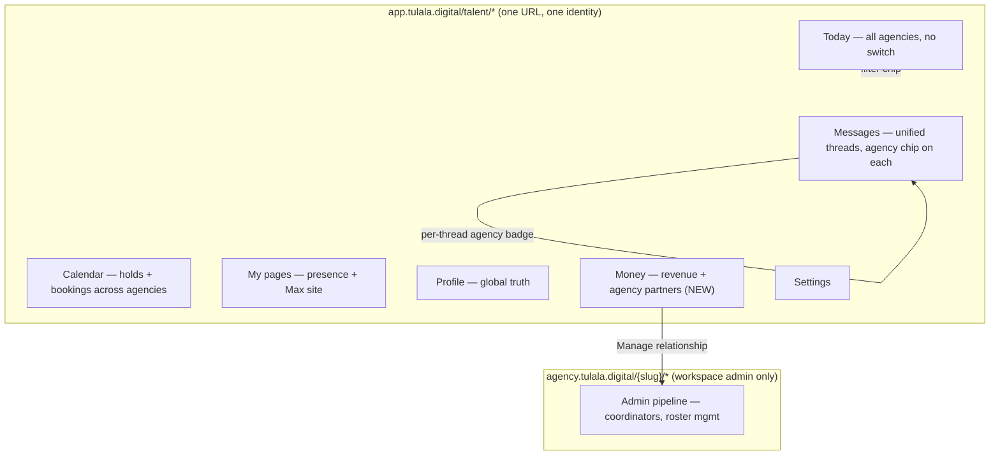
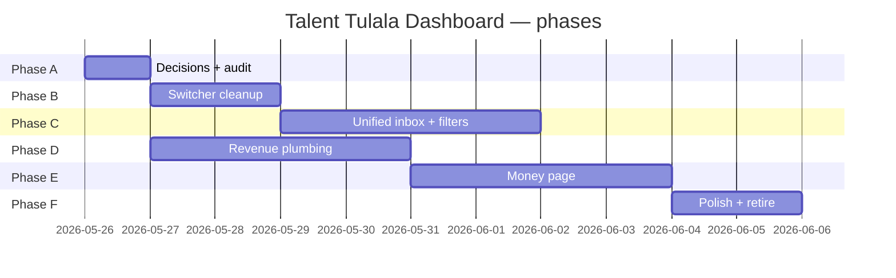

# Tulala Talent Dashboard — Execution Plan (Phase 2.2 → 2.6)

> **Owner direction (2026-05-25):** “A talent logs in once. Tulala is the source of truth.
> Agencies are *who they work through*, not *who they become*. Switching between agencies
> shouldn’t be the default UX. The ‘Agencies’ page should become a Money/Revenue page that
> attracts the talent to click it.”

This document is the source of truth for the Tulala-canonical talent dashboard rebuild.
Read [`docs/decision-log.md`](../decision-log.md), [`web/docs/development-workflow.md`](../../web/docs/development-workflow.md),
and [`docs/saas/phase-1/o1-o7-resolutions.md`](../saas/phase-1/o1-o7-resolutions.md) before starting.

---

## 0. North star

```
One talent identity. Many agency relationships.
Tulala = the dashboard. Agencies = filters + revenue partners.
```

A pure talent (no admin role) opens `app.tulala.digital/talent/today` and sees:

- **All** their work (Today, Messages, Calendar) merged across every agency, with an
  agency badge on each item and an optional filter chip.
- One **Profile** + **Max personal site** owned by them.
- **My pages** — where they appear + roster profile links.
- **Money** — unified revenue + per-agency relationship cards (replaces the current
  Agencies page).

An **agency-staff-who-is-also-talent** keeps the existing `Talent | Workspace` mode
toggle and the agency switcher (because they manage businesses, not just appear in them).

---

## 1. Current state — what works, what’s broken, what’s fake

### 1.1 What works (Phase 2.1, shipped or in this branch)

| Surface | State | Reference |
|---|---|---|
| Login → `/talent/*` on `app.tulala.digital` (no tenant slug) | Working | `web/src/app/(workspace)/talent/layout.tsx` |
| Legacy `/{slug}/talent/*` → 308 → `/talent/*` | Working | `web/src/proxy.ts`, `web/src/lib/talent/legacy-talent-redirect.ts` |
| Max personal site lives at `/t/{code}` on Tulala hosts | Working | `web/src/app/t/[profileCode]/page.tsx` |
| My pages hub (presence + roster links) | Working | `web/src/components/talent/site/TalentSiteAppearancesPanel.tsx` |
| Personal-site actions use `requireTalentSelf()` (no tenant gate) | Working | `web/src/lib/server/talent-self-guard.ts` |
| Agency roster data is cross-tenant | Working | `loadTalentAgencies()` in `_data-bridge/talent.ts` |
| Calendar bookings keyed on `talent_profile_id`, all agencies | Working | migration `20260513081325_talent_calendar_v1.sql` |
| Commission snapshot has `talent_net_cents` per booking | Working | migration `20260513072842_commission_model_foundation.sql` |

### 1.2 What is broken or misaligned

| Issue | Where | Severity |
|---|---|---|
| **Two agency switchers in parallel.** Top “Agency context” dropdown sets a cookie; identity-bar “Acting as …” opens `TalentAgencySwitcherDrawer` that **navigates to `/{slug}/talent`** (legacy path). | `web/src/app/(workspace)/talent/layout.tsx` (line ~164) vs `web/src/components/admin/shell/internal/wave2.tsx` (`TalentAgencySwitcherDrawer`) | P0 — UX confusion |
| **Inbox / Today scoped to one agency at a time** via `loadTalentInquiries(profileId, tenantId)`. Multi-agency talent must switch to see other inbox. | `web/src/app/(workspace)/talent/layout.tsx`, `web/src/app/(workspace)/[tenantSlug]/_data-bridge/talent.ts:389` | P0 — core IA |
| **Identity bar shows hardcoded `3 confirmed · €4,200 YTD`** for the talent surface, not real data. | `web/src/components/admin/shell/internal/page-modules/IdentityBar-1.tsx:122` | P1 — trust |
| **Agencies page shows `bookingsYTD: 0` and `0%` commission** — bridge admits “doesn’t carry this yet”. | `web/src/components/admin/shell/internal/talent/pages/AgenciesPage.tsx:34,93` | P1 |
| **Activity page (earnings)** has a goal ring + ledger + filter chips, but is **mock-only** (`EARNINGS_ROWS` fixture) and **not in nav** (legacy `activity` → redirects to Settings). | `web/src/components/admin/shell/internal/talent/pages/ActivityPage.tsx`, `web/src/components/admin/shell/internal/talent.tsx:280` | P1 — duplicate UI, dead nav |
| **ReachPage** (distribution channels) is still in code but no longer in nav. | `web/src/components/admin/shell/internal/talent/pages/ReachPage.tsx` | P2 — dead code |
| Active-tenant cookie has **no logout / agency-remove invalidation**. | `web/src/lib/talent/active-agency-context.ts` | P2 |
| Nav label `My Site` vs page heading `My pages` was inconsistent. | Fixed in current branch | done |

### 1.3 Data we have but don’t expose to talent

- `talent_bookings (talent_profile_id, tenant_id, …)` — confirmed work across all agencies.
- `booking_commission_snapshot (gross_cents, platform_fee_cents, workspace_fee_cents, talent_net_cents, currency_code)` — per-booking lane split, immutable.
- `inquiry_participants` keyed on `talent_profile_id` — RLS lets talent self read across tenants.
- `stripe_payouts_enabled` on `talent_profiles` (Stripe Connect Express).

**Implication:** YTD revenue is **already in the database**. Wiring it to the UI is mostly aggregation + RLS verification, not new schema.

### 1.4 Data we still need

- A canonical **payout-status timeline per booking** for the talent (paid / pending / invoiced). Likely a view on top of `talent_bookings` + `booking_commission_snapshot` + (future) `talent_payouts`.
- **Manual earnings** for off-platform work (cash, in-kind) — referenced in `EarningsRow.paymentMethod` but no table exists.
- **Per-roster commission rate** for the talent’s view (today commission lives at tenant-level in `workspace_commission_overrides`, not per roster row).

---

## 2. Target architecture

### 2.1 Tulala-canonical talent shell



### 2.2 Who switches, who doesn’t

| User shape | Identity-bar switcher? | Inbox scope | Money scope |
|---|---|---|---|
| **Pure talent, 1 agency** | hidden | unified | unified |
| **Pure talent, N agencies** | hidden by default; **filter chip** in Today/Messages/Money | unified by default, filterable | unified, per-agency cards below |
| **Hybrid: agency staff + talent on this agency** | `Talent ↔ Workspace` mode toggle (existing) | unified in talent mode | unified |
| **Hybrid: agency staff at agency A, also talent at agency B** | mode toggle + workspace tenant-switcher (workspace mode only) | unified in talent mode | unified |

The new top “Agency context” dropdown introduced in Phase 2.1 is **removed**. The legacy
identity-bar “Acting as …” switcher is **gated to hybrid users** and, for them, redesigned
to be a **workspace** tenant switcher, not a talent one.

### 2.3 Money page IA

```
Money
├── Hero strip
│   ├── YTD earned · €X (all agencies + personal page)
│   ├── Pending · €Y (invoiced not yet paid)
│   ├── Confirmed pipeline · €Z (booked, not yet invoiced)
│   └── Goal progress ring (reuse from ActivityPage)
│
├── Agencies & relationships (replaces flat Agencies list)
│   For each roster:
│   ├── Agency name + plan-tier chip + exclusivity status
│   ├── Per-agency YTD revenue + commission rate
│   ├── Bookings count + last booking date
│   ├── Actions: View roster profile · Manage relationship
│   └── Empty state: “Agencies invite talent — share your profile”
│
├── Earnings ledger
│   ├── Source filter chips: All · Agency-routed · Personal page · Hub
│   ├── Status filter chips: Paid · Pending · Invoiced
│   ├── Per-row: date · client · agency · gross · talent-net · status · payment method
│   └── Drawer: row detail (existing talent-earnings-detail drawer)
│
├── Payouts
│   ├── Stripe Connect status (existing)
│   └── Next expected payout
│
└── Grow
    ├── Find new agencies (links to Tulala discovery / hub when live)
    ├── Leave an agency (existing flow)
    └── Boost reach (Pro/Max upsell tile if applicable)
```

---

## 3. Phasing

Six phases. Each ships independently and is testable against the production smoke pack.

| Phase | Theme | Time | Risk | Depends on |
|---|---|---|---|---|
| **A** | Decision freeze, audit doc, fixtures sweep | 0.5 d | low | — |
| **B** | Identity + switcher cleanup | 2 d | medium (multi-tenant RLS surface) | A |
| **C** | Unified Today/Messages/Calendar across agencies | 3–4 d | high (inbox is critical path) | B |
| **D** | Revenue plumbing — DB → talent self-view | 3–4 d | medium | A |
| **E** | Money page (replace Agencies) | 3–4 d | medium | D |
| **F** | Polish, dead-code retirement, docs, e2e | 2 d | low | C + E |

Total: ~14 working days for one focused agent. Each phase has a hard `npm run typecheck && npm run lint && npm run test:tenant-isolation` gate.

---

## 4. Phase A — Decision freeze & sweep (0.5 d)

### A.1 Goals

1. Lock the IA in `docs/decision-log.md`.
2. Inventory every mock fixture used on the talent surface.
3. Choose terminology: **Money** vs **Revenue** vs **Finance**.

### A.2 Tasks

| # | Task | Files | Output |
|---|---|---|---|
| A.1 | Add **L41** to decision log: *Talent surface is Tulala-canonical. Agency context is a filter, not a route prefix, for pure talent.* | `docs/decision-log.md` | committed |
| A.2 | Add **L42**: *Agency switcher is gated to hybrid users (workspace mode). Pure talent never sees it.* | same | committed |
| A.3 | Add **L43**: *Earnings are sourced from `talent_bookings` + `booking_commission_snapshot`. Mock `EARNINGS_ROWS` is deprecated.* | same | committed |
| A.4 | Pick label. Recommend **Money** (shortest, most attractive, neutral across languages). | `web/src/components/admin/shell/internal/state/fixtures.ts` (`TALENT_PAGE_META`) | reflected in P-E |
| A.5 | Open question doc: *Per-roster commission rate — do we add it now or carry tenant-level for v1?* | this file, §10 | answer needed before D |

### A.3 Acceptance

- Decision log updated, new label chosen, open questions listed.

---

## 5. Phase B — Identity + switcher cleanup (2 d)

### B.1 Goals

- Remove the top “Agency context” dropdown for pure talent.
- Repurpose identity-bar “Acting as …” to be **workspace-only**.
- Replace `TalentAgencySwitcherDrawer` with a thin **filter** drawer (or drop entirely if filter chips suffice).
- Add a tiny **“You appear on N agencies”** chip in the identity bar instead.

### B.2 Tasks

| # | Task | Files | Notes |
|---|---|---|---|
| B.1 | Drop top `TalentAgencyContextSwitcher` render block in platform talent layout. Leave the helper component file for now (Phase F deletes it). | `web/src/app/(workspace)/talent/layout.tsx:156–169` | keep cookie helpers — still used by deep links |
| B.2 | In `IdentityBar-1.tsx`, branch on `inWorkspace`: only workspace surface gets the “Acting as <tenant>” affordance. For talent, show **profile display name + agency-count chip** (“2 agencies”) that opens the Money page. | `web/src/components/admin/shell/internal/page-modules/IdentityBar-1.tsx:95–127` | preserve i18n labels |
| B.3 | Gate `TalentAgencySwitcherDrawer` behind `state.alsoTalent || isHybrid`. For non-hybrid talent, never render the drawer. | `web/src/components/admin/shell/internal/wave2.tsx:1334–…` | drawer can later be repurposed for hybrid workspace-switch |
| B.4 | Remove hardcoded YTD copy from identity bar; replace with a small skeleton placeholder until D.4 wires real data. | `IdentityBar-1.tsx:122` | acceptable to ship neutral “Active on 2 agencies” copy in interim |
| B.5 | Keep `ACTIVE_TALENT_TENANT_COOKIE` for deep-link use (`/talent/messages?agency=morena-studio`) but stop *defaulting* to it for general data loads. | `web/src/lib/talent/active-agency-context.ts` | cookie becomes a filter hint, not an identity |
| B.6 | Unit tests: `platform-talent-shell.test.ts` asserts switcher is hidden when `agencyOptions.length > 1` but `isHybrid === false`. | `web/src/lib/talent/platform-talent-shell.test.ts` | extend existing test |
| B.7 | E2e: update `web/e2e/talent-platform-ia.spec.ts` — switcher absent for `qa-talent-dashboard-audit@…` (now has 2 agencies after Phase 2.1 migration). | `web/e2e/talent-platform-ia.spec.ts` | already has 2-agency case |

### B.3 Acceptance

- `more@impronta.test` and `qa-talent-dashboard-audit@impronta.test` (both pure talent on 2 agencies after Phase 2.1) see **no** switcher.
- A hybrid agency-staff user still sees the `Talent ↔ Workspace` mode toggle (separate concept — keep).
- E2e green.

### B.4 Risk + mitigation

- *Risk:* hidden switcher hides a feature hybrid users rely on. *Mitigation:* gate strictly on the `isHybrid` boolean already supplied by the layout.

---

## 6. Phase C — Unified Today / Messages / Calendar (3–4 d)

### C.1 Goals

- Talent inbox shows threads from **every** agency the talent participates in.
- Each thread has an inline **agency badge** (Impronta / Morena / Direct).
- Optional **filter chip row** above the inbox (“All · Impronta · Morena · Direct”).
- Calendar already cross-tenant — verify and add filter chips.

### C.2 Data layer

| # | Task | Files | Notes |
|---|---|---|---|
| C.1 | Add `loadTalentInquiriesAllAgencies(talentProfileId)` — same as `loadTalentInquiries` but drops the `.eq("inquiries.tenant_id", tenantId)` filter. RLS already allows it (`inquiry_participants_talent_select`). | `web/src/app/(workspace)/[tenantSlug]/_data-bridge/talent.ts` | preserve existing `loadTalentInquiries` for admin code |
| C.2 | Add a join on `agencies` to surface `display_name` + `slug` per thread. | same | minimal extra columns |
| C.3 | Update `platform/talent/layout.tsx` to call `loadTalentInquiriesAllAgencies(...)` regardless of active tenant. Active tenant becomes a **filter** passed to client. | `web/src/app/(workspace)/talent/layout.tsx:106–115` | bridge field stays `talentInquiries` (compat) but is now cross-tenant |
| C.4 | Tenant isolation test: ensure RLS still blocks viewing inquiries the talent isn’t a participant on. | `web/src/lib/rls/*` tests | use existing `npm run test:tenant-isolation` |

### C.3 UI layer

| # | Task | Files |
|---|---|---|
| C.5 | Today + Messages render an agency chip on every conversation card. | `web/src/components/admin/shell/internal/talent/shared/today-*.tsx`, `…/messages/*` |
| C.6 | Add `talentAgencyFilter` to `AdminShellState` (`"all" \| tenantId`). Persist to URL `?agency=...` via existing route syncer. | `web/src/components/admin/shell/internal/state/context.tsx` |
| C.7 | Filter chip row: render only when `bridgeTalentAgencies.length > 1`. | new component `TalentAgencyFilterChips.tsx` in `internal/talent/shared/` |
| C.8 | Calendar respects the same filter; calendar entries already carry `tenant_id`. | `loadTalentCalendarEntries` + page |
| C.9 | Unread badge math: aggregate across agencies; per-agency unread on the filter chip. | `bridgeTalentUnread` derivation |

### C.4 Acceptance

- Pure talent on Impronta + Morena sees **all** threads in `/talent/messages`, with agency badges.
- Selecting filter chip “Impronta” narrows the list; URL becomes `/talent/messages?agency=impronta`.
- Unread counts sum correctly across agencies.
- Tenant-isolation tests still pass.

### C.5 Risk + mitigation

- *Risk:* RLS regression leaking cross-tenant threads. *Mitigation:* `npm run test:tenant-isolation` is a hard gate; add explicit test where `Talent X` cannot see `Talent Y`’s threads from the same agency.

---

## 7. Phase D — Revenue plumbing (3–4 d)

### D.1 Goals

- Server-side view that returns, per talent, **aggregate revenue + per-agency breakdown + per-booking earnings** from real DB tables.
- Replace `EARNINGS_ROWS` fixture with real data on the talent surface.
- No new schema unless §10 OQ-3 (per-roster commission rate) is approved.

### D.2 Data layer

| # | Task | Files | Notes |
|---|---|---|---|
| D.1 | New server module `web/src/lib/talent/earnings.ts` exporting `loadTalentEarnings(talentProfileId, { sinceISO?, agencyFilter? })`. | new file | join `talent_bookings` ↔ `booking_commission_snapshot` ↔ `agencies` ↔ optional `inquiries.client_name` |
| D.2 | Return shape: `{ totals: { ytdGrossCents, ytdNetCents, pendingCents, confirmedPipelineCents, currency }, perAgency: [{ tenantId, slug, name, ytdNetCents, bookingsCount, lastBookingAt, commissionBps }], rows: [...EarningsRow] }`. | same | currency: assume EUR for v1; fail-soft on multi-currency |
| D.3 | RLS check: `talent_bookings_select_self` (already exists) + `booking_commission_snapshot` policy. Confirm a talent can read snapshots for bookings where they are the `talent_profile_id`. Add policy if missing. | possible new migration `…_talent_can_read_own_commission_snapshot.sql` | inspect snapshot RLS first |
| D.4 | Identity-bar real YTD: identity bar reads `loadTalentEarnings({…}).totals.ytdNetCents`. Replace the hardcoded line. | `IdentityBar-1.tsx:122` | one fetch per layout render, cache via React `cache()` |
| D.5 | Add zod schemas + unit tests for `loadTalentEarnings`. | `web/src/lib/talent/earnings.test.ts` | fixtures via `qa-talent-dashboard-audit@impronta.test` |

### D.3 Open data questions (must be resolved before D.1)

- **Per-roster commission rate**: today commission is at tenant level (`workspace_commission_overrides`). If product wants “Impronta 18% / Morena 12%”, we need either:
  - (a) Display tenant-default rate (cheap, possibly inaccurate per booking),
  - (b) Compute realized rate per booking from `booking_commission_snapshot` (`workspace_fee_cents / gross_cents`), then average for the agency card (recommended),
  - (c) Add `agency_talent_roster.commission_override_bps` (new column, new migration).

  **Recommendation: (b) for v1**, ship (c) only if a real customer asks.

### D.4 Acceptance

- `loadTalentEarnings(profileId)` returns correct totals for `qa-talent-dashboard-audit@…` (verify against direct SQL).
- Identity bar shows real YTD on `/talent/today`.
- New unit tests pass.
- Tenant isolation: a talent cannot see another talent’s `booking_commission_snapshot` rows.

---

## 8. Phase E — Money page (3–4 d)

### E.1 Goals

- New canonical nav item replacing **Agencies** with **Money**.
- Composes hero strip + per-agency cards + earnings ledger + payouts + grow.
- Drawers reused: `talent-agency-relationship`, `talent-earnings-detail`, `talent-payouts`.

### E.2 Tasks

| # | Task | Files |
|---|---|---|
| E.1 | Add `TalentPage` value `money` and **remove** `agencies` from nav (`TALENT_PAGES`); keep `agencies` in the type union for URL backward-compat (route alias to `money`). | `web/src/components/admin/shell/internal/state/types.ts`, `fixtures.ts` |
| E.2 | New page component `MoneyPage.tsx` under `internal/talent/pages/`. | `web/src/components/admin/shell/internal/talent/pages/MoneyPage.tsx` |
| E.3 | Hero strip: 4 KPIs (YTD net, pending, confirmed pipeline, goal ring). Reuse `EarningsGoalRing` from `ActivityPage.tsx`. | extracted into shared `talent/shared/MoneyKpiStrip.tsx` |
| E.4 | Per-agency relationship card grid (1-up on mobile, 2-up on desktop). Real `ytdNetCents`, `bookingsCount`, `commissionBps` from D.2. CTAs: **View roster profile** (already in `agency-roster-profile-url.ts`) + **Manage relationship** (existing drawer). | same file |
| E.5 | Earnings ledger: lift the table + filter chips from `ActivityPage` into `talent/shared/EarningsLedger.tsx`. Source = `loadTalentEarnings.rows`. | new shared file |
| E.6 | Payouts strip: Stripe Connect status from `talent_profiles.stripe_payouts_enabled` + next expected payout (best-effort: latest pending booking ETA). | same |
| E.7 | Grow strip: 3 cards — Find more agencies (placeholder until hub directory ships), Leave an agency (existing flow), Boost reach (Pro/Max upsell). | same |
| E.8 | URL route: `/talent/money` (alias `/talent/agencies` and `/talent/activity` 308 → `/talent/money`). | `web/src/app/(workspace)/talent/money/page.tsx` + `web/src/app/(workspace)/talent/agencies/page.tsx` redirect |
| E.9 | Talent shell route syncer: map `MoneyPage` ↔ `/talent/money`. | `web/src/components/admin/shell/internal/talent.tsx` |
| E.10 | Delete `AgenciesPage.tsx` and `ActivityPage.tsx` once feature parity is verified by hand. (`ReachPage.tsx` already orphaned — delete too.) | files removed |
| E.11 | E2e: extend `talent-platform-ia.spec.ts` with `/talent/money` → KPIs render, agency cards present, ledger has rows or empty state, links target right hosts. | `web/e2e/talent-platform-ia.spec.ts` |

### E.3 Acceptance

- `/talent/money` renders for QA audit talent with two agencies and visible YTD numbers.
- `/talent/agencies` and `/talent/activity` 308 → `/talent/money`.
- Nav shows: Today · Messages · My pages · Profile · Calendar · **Money** · Settings.
- E2e covers the new route.

### E.4 Visual & a11y bar

- Hero KPIs use existing `fmtMoney` helper (EUR; multi-currency in v2).
- All ledger rows reachable by keyboard, with `aria-label` on row buttons (existing pattern in `ActivityPage`).
- Empty states for: zero bookings, zero agencies, Stripe not connected.

---

## 9. Phase F — Polish, retirement, docs (2 d)

### F.1 Tasks

| # | Task |
|---|---|
| F.1 | Delete `TalentAgencyContextSwitcher.tsx` and its imports (Phase B already stopped rendering it). |
| F.2 | Delete `TalentAgencySwitcherDrawer` if hybrid users have no use, OR refactor to a workspace-only switcher. (Decision in Phase B.) |
| F.3 | Delete `ReachPage.tsx`, `ActivityPage.tsx`, `AgenciesPage.tsx` (now superseded by `MoneyPage`). |
| F.4 | Remove `EARNINGS_ROWS` fixture from `fixtures.ts`. Keep `EarningsRow` type if referenced. |
| F.5 | Update `docs/decision-log.md` L41–L43 status to **shipped**. |
| F.6 | Add a short follow-up to `web/docs/talent-monetization.md` describing the Money page surface. |
| F.7 | Final QA pass on both QA users (`qa-talent-dashboard-audit@…`, `more@…`) on prod after promote. |
| F.8 | `cd web && npm run ci` (tenant + isolation full suite). |
| F.9 | `npm run deploy:smoke` after promote. |

---

## 10. Decisions (resolved 2026-05-25)

| OQ | Question | Decision |
|---|---|---|
| OQ-1 | Page label | **Money** ✓ |
| OQ-2 | Currency | **EUR-only v1**; per-booking display in v2 ✓ (default) |
| OQ-3 | Per-roster commission rate | **Derive from `booking_commission_snapshot`** (option b). Admin custom `%` / fixed commission may be built by a separate agent on the admin side; talent Money page reads *realized* rates from snapshots regardless of how admin configures them, so the two tracks do not block each other. ✓ |
| OQ-4 | Manual / off-platform earnings entry | **Punt to v2**. v1 shows only on-platform bookings. ✓ |
| OQ-5 | Agency filter UX | **Chips** inline (default). |
| OQ-6 | Talent Money vs Admin Business Financials | **Two separate surfaces. Never merged.** `/talent/money` is the talent's *personal* earnings view. Workspace admin gets a *Business Financials* page (separate workstream, §16) showing agency-level revenue / commission lanes / payouts owed to talent / platform fees. Both surfaces read from the same `booking_commission_snapshot` table but project different lanes:<br>• **Talent Money** → `talent_net_cents` (what *I* earned).<br>• **Business Financials** → `workspace_fee_cents` + payouts owed (what *the agency* earned and owes). ✓ |
| OQ-7 | Cross-profile aggregation for users with multiple talent profiles | **No.** One profile per user (per `o1-o7-resolutions`). ✓ |

---

## 11. Risk register

| Risk | Likelihood | Impact | Mitigation |
|---|---|---|---|
| RLS regression — talent sees another talent’s threads or snapshots | low | critical | `npm run test:tenant-isolation` gate; add explicit cross-talent tests in Phases C + D |
| Cookie-based active tenant still drives some surface unnoticed | medium | medium | grep for `ACTIVE_TALENT_TENANT_COOKIE` after Phase B and document remaining consumers |
| Identity-bar copy breaks layout on small screens when YTD grows | low | low | reserve fixed-width tabular figures, truncate >€999k with “€999k+” |
| Migration `_talent_can_read_own_commission_snapshot.sql` blocked by existing snapshot policy | low | medium | inspect policy before writing; might already cover via `talent_bookings_select_self` join |
| Hidden agency switcher confuses hybrid agency-staff users who *also* model | medium | medium | mode toggle stays; add a one-line tooltip “Workspace mode lets you switch agencies” |

---

## 12. Sequencing diagram



D can run in parallel with B/C if a second agent is available; E requires D done; F requires C + E.

---

## 13. Definition of done (whole effort)

1. Pure talent with N agencies logs in once and never sees an “agency context” switcher.
2. Today / Messages / Calendar show all work across agencies with optional filter chips.
3. `/talent/money` ships and shows real YTD + per-agency cards + ledger backed by `booking_commission_snapshot`.
4. `AgenciesPage`, `ActivityPage`, `ReachPage`, `EARNINGS_ROWS` are removed; `TalentAgencyContextSwitcher` removed; identity-bar Acting-as switched to workspace-only.
5. `docs/decision-log.md` L41–L43 marked shipped.
6. `npm run typecheck && npm run lint && npm run test:tenant-isolation && npm run ci` green.
7. `npm run deploy:smoke` clean on prod after promote.
8. Phase 2.1 e2e + new Phase 2.2 cases pass on both QA accounts.

---

## 14. Out of scope (track separately)

- Multi-currency display & FX.
- Manual off-platform earnings entry UI.
- Tax / 1099 / Modelo doc generation.
- Hub directory & “apply to agency” flow.
- Talent referral / network growth analytics beyond Reach-style toggles.
- Per-roster commission overrides table (only if a customer asks).
- **Admin Business Financials surface** — see §15. Separate workstream, separate agent if parallelized.
- **Admin custom % / fixed commission configuration UI** — partially exists at platform-admin level (`/platform/admin/billing/commission`); per-tenant admin UI to *set* their own commission is a separate workstream the user may spawn. Talent Money does not block on it.

---

## 15. Adjacent workstream — Admin Business Financials (separate plan)

> **Owner direction (2026-05-25):** *"Money is only from Talent. Admin should have a
> business financials page so they can see how the business did revenues. The two should
> not be combined."*

This section is **scaffolding for a separate plan**, not part of this execution.
It exists here so the talent Money work does not accidentally couple to admin surfaces.

### 15.1 Status today

| Surface | State |
|---|---|
| `workspace-revenue` drawer (mock data) | `web/src/components/admin/shell/internal/drawers/light-15.tsx`, opened from `OverviewPage` + `OperationsPage` |
| Platform-admin commission config (Tulala HQ) | `web/src/app/(workspace)/platform/admin/billing/commission/*` — sets platform take, not per-agency revenue |
| Per-tenant commission override config | `workspace_commission_overrides` table + platform-admin actions, but **no per-agency admin UI** to view their own revenue lane |
| Agency-staff "Acting as <tenant>" identity bar copy: `"€4,200 pending · 3 confirmed"` | hardcoded fixture in `IdentityBar-1.tsx:119` |

There is **no canonical admin Business Financials page today**.

### 15.2 Recommended target

A new canonical route `/{tenantSlug}/admin/financials` (or `/admin/financials` in platform-routed admin, when that lands), composed of:

- **P&L strip:** monthly revenue, commission paid out to talent, platform fee paid to Tulala, net.
- **Talent payouts:** what the agency owes / has paid to each rostered talent (cross-reference of `booking_commission_snapshot.talent_net_cents` aggregated per talent for this tenant).
- **Client revenue ranking:** top clients by booked gross.
- **Invoices / payment status:** linked to existing `payment_status` machine.
- **Commission policy:** read-only view of the resolved rate (platform default → plan tier → tenant override), with a CTA to request a change (if admin self-serve doesn't exist yet).

### 15.3 Shared source of truth

Both Talent Money and Admin Business Financials read from:

- `booking_commission_snapshot` — immutable per-booking lanes (gross / platform / workspace / talent net).
- `talent_bookings` — confirmed work.
- `workspace_commission_overrides` + `platform_commission_config` — rate resolution chain.

The split is **purely a projection**:

| Lane | Talent Money sees | Admin Business Financials sees |
|---|---|---|
| `gross_cents` | reference only | total revenue |
| `platform_fee_cents` | reference only | cost (paid to Tulala) |
| `workspace_fee_cents` | reference only | **agency's earned commission** |
| `talent_net_cents` | **the talent's earnings** | payout owed |

So the Phase D server module `loadTalentEarnings` and any future `loadAgencyFinancials` should share a small lower-level helper (`web/src/lib/billing/snapshot-aggregations.ts`, to be created with the admin plan) so both views agree to the cent.

### 15.4 Non-goals in this plan

- Implementing `/admin/financials`.
- Implementing per-tenant admin commission configuration UI.
- Migrating `workspace-revenue` drawer's mock data.

These are tracked outside this document. If a parallel agent picks them up:

- They **must** read `loadTalentEarnings` source (Phase D output) so the shared aggregation helper stays consistent.
- They **must not** repurpose `/talent/money` for admin.
- They **must** add their own decision-log entry (L44+).

---

## 16. Reference index (read before each phase)

| Concern | File |
|---|---|
| Platform talent layout (entry) | `web/src/app/(workspace)/talent/layout.tsx` |
| Talent shell client | `web/src/components/admin/shell/admin-shell-client.tsx` |
| Talent identity bar | `web/src/components/admin/shell/internal/page-modules/IdentityBar-1.tsx` |
| Talent pages router | `web/src/components/admin/shell/internal/talent.tsx` |
| Agencies page (current) | `web/src/components/admin/shell/internal/talent/pages/AgenciesPage.tsx` |
| Activity page (earnings, mock) | `web/src/components/admin/shell/internal/talent/pages/ActivityPage.tsx` |
| Talent data bridge | `web/src/app/(workspace)/[tenantSlug]/_data-bridge/talent.ts` |
| Active agency cookie | `web/src/lib/talent/active-agency-context.ts` |
| Roster profile URL helper | `web/src/lib/talent/agency-roster-profile-url.ts` |
| Commission schema | `supabase/migrations/20260513072842_commission_model_foundation.sql` |
| Calendar / bookings schema | `supabase/migrations/20260513081325_talent_calendar_v1.sql` |
| Tenant isolation tests | `npm run test:tenant-isolation` |
| Phase 2.1 e2e | `web/e2e/talent-platform-ia.spec.ts` |
