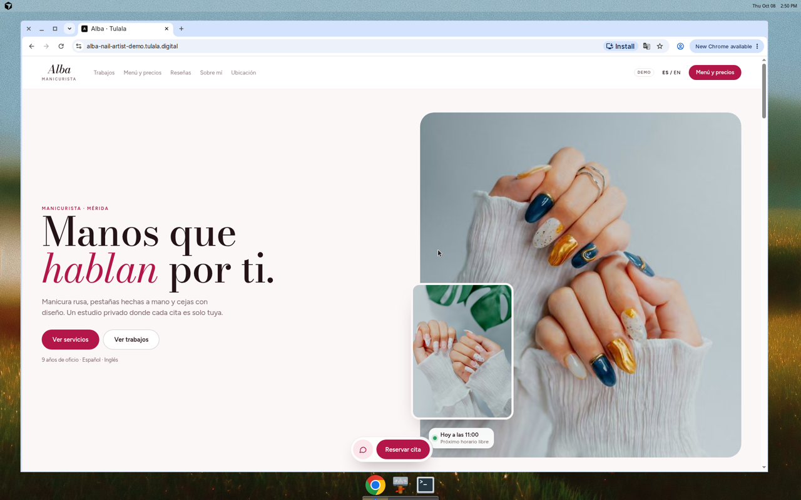
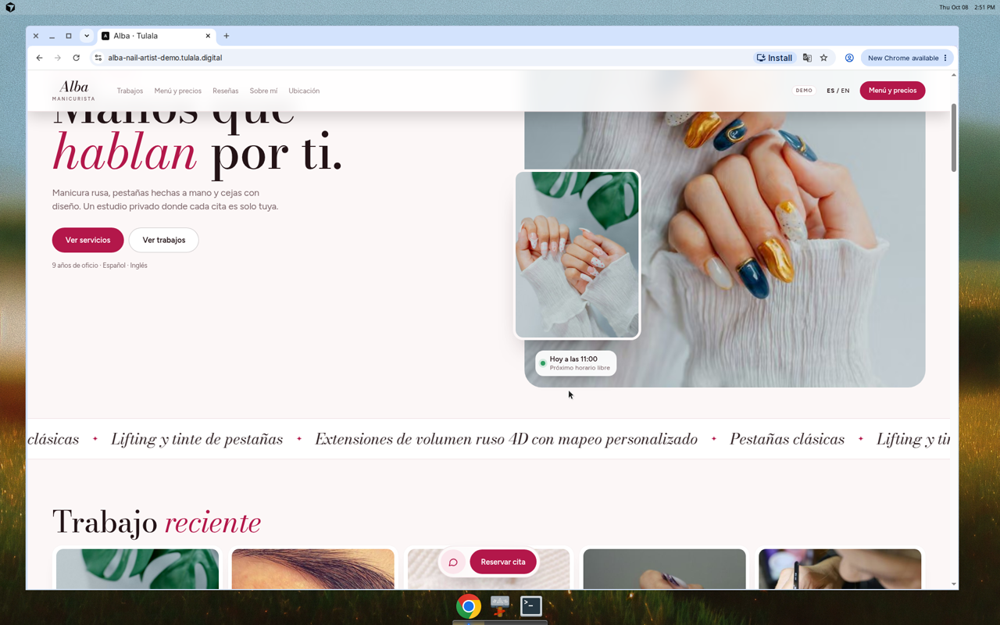
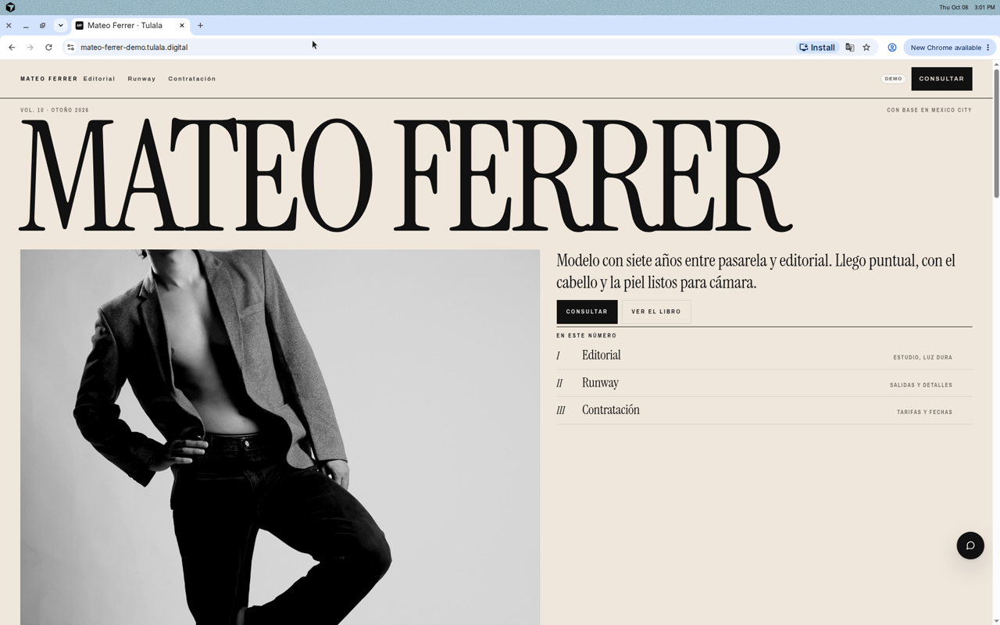
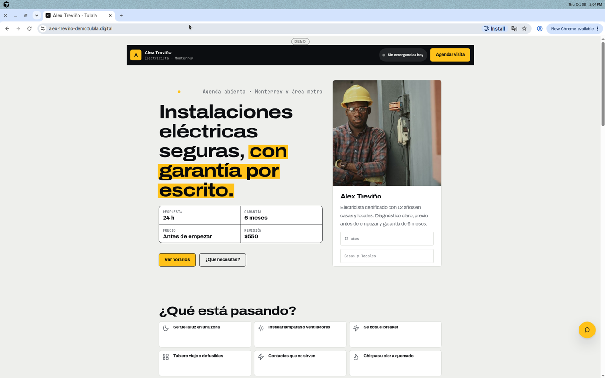
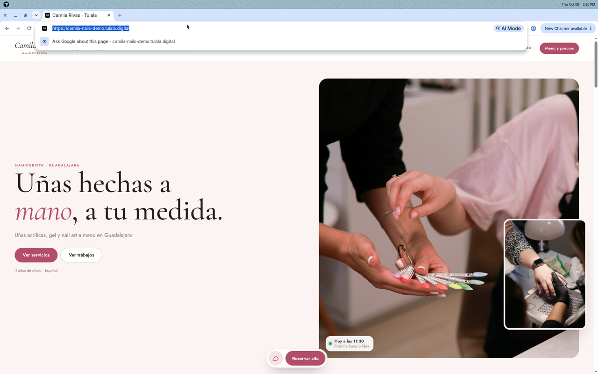
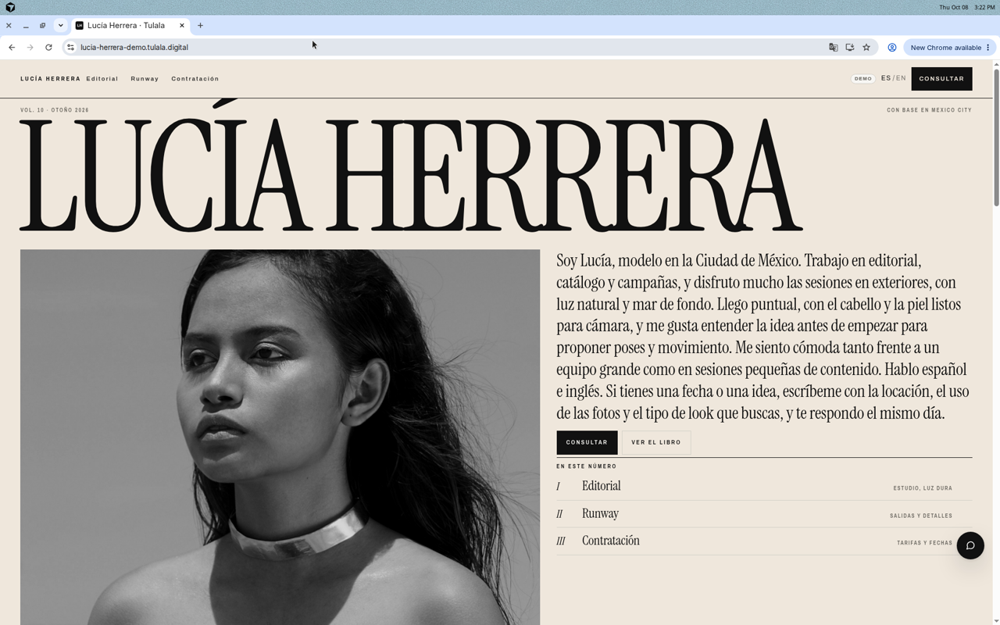
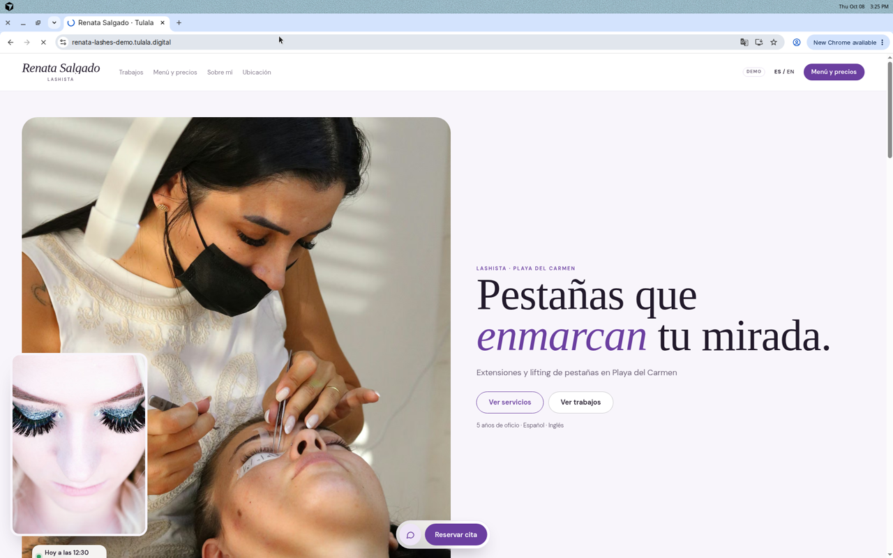
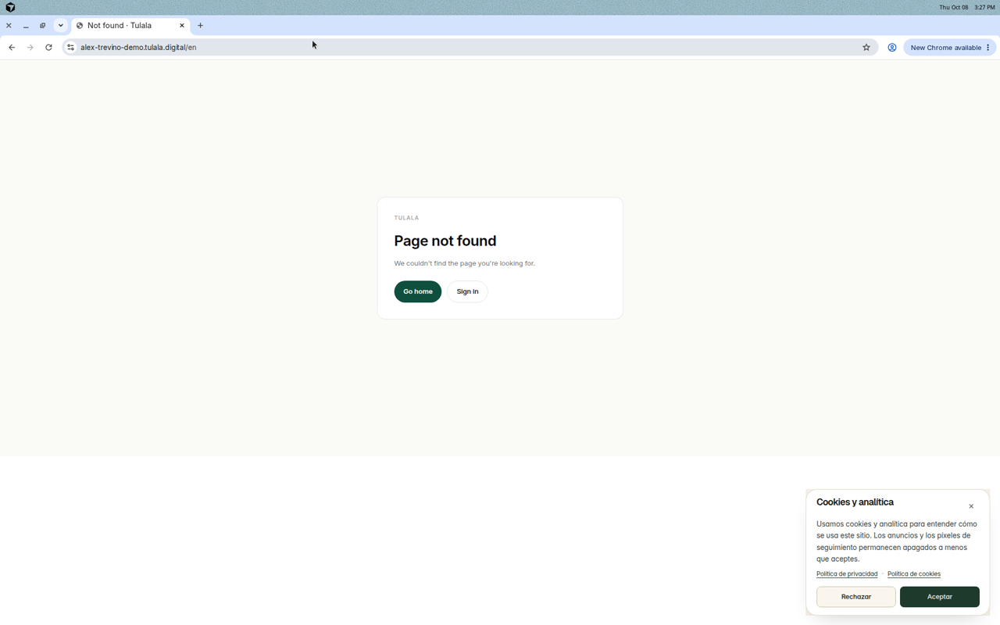
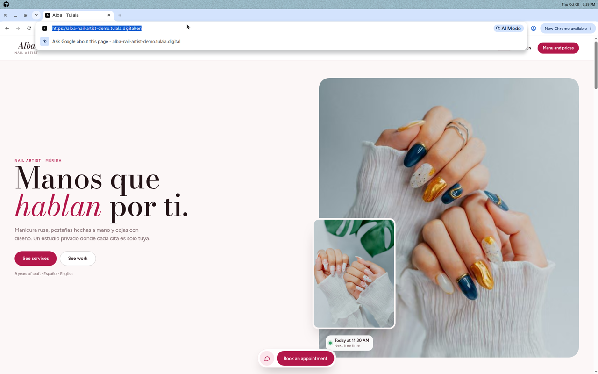

# TUL-208 — Template and theme experience audit (2026-10-08)

**Status:** Dev QA · Chat = Cursor · PR for this doc  
**Method:** Production read-only on public demo sites + code/docs for Builder Lab and talent dashboard. **Never signed in.** Never wrote TAL-93938.  
**Related:** [theme-release-chain-audit](../handover/cursor-2026-10-04/docs/theme-release-chain-audit.md), [how-to-make-a-new-theme](../factory/how-to-make-a-new-theme.md), Project store code pass `internal/tul-208-talent-theme-ux-audit.md`.  
**Evidence:** [theme-experience-audit-2026-10-08/evidence/](./theme-experience-audit-2026-10-08/evidence/)

---

## Verdict

Finished gallery is four designs (`maison`, `maison-v2`, `folio`, `gridline`). Public reference demos look strong on desktop Spanish, but the **talent change-design path is split**, **ES locale on demos is mostly broken (`/en` → 404)**, and **three unfinished collection designs (solace, mono, frame) have no Theme Review mockup**, which correctly parks TUL-37.

| Lane | Score (clarity / steps / look) | Notes |
|---|---|---|
| A. Builder Lab Factory → release | Not browser-verified (needs platform admin) | Code map clear; sync dumps raw JSON; Open to talents is a separate step from Make default |
| B1. Discover / gallery | 5/10 | Two pickers; Manager path has weak confirm; planned demos fall back silently |
| B2. Public demo quality (ES home) | 8/10 | Alba, Mateo, Alex, Camila, Lucía, Renata look finished after hard load |
| B3. Public demo quality (EN `/en`) | 2/10 | Alex/Mateo/Camila `/en` → 404; Alba `/en` loads with Spanish hero copy |
| B4. Soft-nav between demos | 3/10 | Cross-host navigation can show the previous talent until hard reload |
| B5. Theme Review mockups | 4/10 | Folio + Gridline complete; Maison v2 missing `kit.js`; solace/mono/frame none |

---

## Theme Review mockup (definition)

A **Theme Review mockup** is the pinned, versioned design artifact that proves a talent Design is finished enough to open to talents. It is **not** a Figma export alone and **not** a live demo site. Per `docs/factory/how-to-make-a-new-theme.md` §4 and `web/design-references/README.md`:

1. **Static HTML + shared kit** under `web/design-references/<slug>/`:
   - `index.html`, `kit.js`, `img/`
   - `README.md` (source artifact URL, version, capture date, reference demo, palettes, fonts, units table: selector / `data-w` / builder status)
   - `parity-map.json` (mockup unit → product section)
   - `content.json` (reference demo copy word-for-word from the mockup)
2. **Unit contract:** every visual unit carries `data-w="<kit type> · <variant>"` so parity and the design compiler can map to kit blocks.
3. **Index row** in `web/design-references/README.md`.
4. **Parity proof:** `npm run qa:mockup-parity -- --design <slug> --talents <ref demo> --widths 390,360,1440` (pixel gate on the reference demo). Unfixable deltas go in `parity-baseline.json` with a ticket; never edit the mockup or thresholds to go green.
5. **Reference demo** whose published content matches `content.json`.
6. **Authored overlay** pulled after Factory publish (`pull-authored.mts`) so code equals the DB-authored version.

**Finished rule (PM 2026-10-08 on TUL-37):** no theme is finished without a Theme Review mockup.

### Mockup inventory (unblocks TUL-37)

| Design | Gallery status | Theme Review mockup | Gap |
|---|---|---|---|
| `maison` | Finished (legacy) | None (starter seed, not collection mockup) | Out of Theme Review scope |
| `maison-v2` | Finished | Partial: `index.html`, `content.json`, `parity-map.json`, `README.md`; **no `kit.js`**; no authored overlay | Complete kit pin + overlay |
| `folio` | Finished | Complete (incl. `kit.js`) + `authored/folio.overlay.json` | — |
| `gridline` | Finished | Complete on disk; **missing from** `design-references/README.md` table; no authored overlay | README row + overlay |
| **`solace`** | Hidden unfinished | **None** | Needs full Theme Review pack before TUL-37 can finish it |
| **`mono`** | Hidden unfinished | **None** | Same |
| **`frame`** | Hidden unfinished | **None** | Same |

Widget gaps still blocking unfinished designs (`COLLECTION_DESIGN_GAPS`): solace (rotating word, hero toggle), mono (no-nav header, slot picker), frame (contact-sheet filter/loupe).

---

## Flow map (code)

1. **Factory** — `/platform/admin/builder-lab` Talent Template Factory → edit `/talent-designs/<slug>/edit`.
2. **Publish demos** — Publicar y actualizar demos (version + release + demos; not open to talents).
3. **Release manager** — `/platform/admin/builder-lab/themes/<releaseId>` → Open to talents → optional Make default.
4. **Talent pick** — Maison setup (`ThemeDetailScreen` + `PublishDesignDialog`) when Maison cohort on; else `PresenceLiveFallback` → `ManagerThemeGallery` (`window.confirm` → draft apply).
5. **Updates** — `ThemeUpdateNotice` → apply to draft → talent must Publish separately.
6. **Edit / publish** — `/talent/page-builder` + `PublishDrawer` preflight.

---

## Production screenshots (read-only)

| Shot | What |
|---|---|
|  | Maison v2 reference — Alba ES hero |
|  | Alba mid-page portfolio |
|  | Folio reference — Mateo |
|  | Gridline reference — Alex |
|  | Maison v2 live demo (after hard reload) |
|  | Folio live demo |
|  | Maison v2 live demo |
|  | Soft-nav bug: `camila-nails-demo` showed Alex |
|  | Gridline `/en` → branded 404 + ES cookie banner |
|  | Alba `/en` loads; hero still Spanish |

Also: soft-nav wrong-content shots for Lucía→Camila and Renata→Lucía; marketing homepage `tulala-marketing-1440.png`. Store copies under Project media `media/tul-208-theme-audit/`.

---

## Scored gaps

Priority: **P0** = wrong content / trust break / wipe risk · **P1** = blocks good theme UX or EN · **P2** = polish / Factory / inventory.

### P0

| ID | Gap | Evidence | Fix direction | Triage |
|---|---|---|---|---|
| **G1** | Dual change-design UIs: Maison keep/change publish dialog vs Manager `window.confirm` draft-only apply | `ManagerThemeGallery.tsx` confirm; `PublishDesignDialog` | One safety model for all cohorts | [board](https://app.notion.com/p/3f32c5ee97438161aec4fbd67d50bca4) (also covers G9) |
| **G2** | Soft-nav / RSC cache: navigating between `*-demo.tulala.digital` hosts can render the previous talent until hard reload | `camila-nails-ERROR-shows-alex-content.png` et al.; curl titles correct | Host-scoped cache / full navigation for talent hosts | [board](https://app.notion.com/p/3f32c5ee974381669f2cd57cba9a35c4) |
| **G3** | Most finished demos `/en` → 404 (Alex, Mateo, Camila). Alba `/en` works but Spanish hero leaks | curl 404; `alex-trevino-1440-en-404-spanish-leak.png`; Alba HTML still has "Manos que" | Locale enablement per demo + seed EN copy (Gridline EN seed also morning item 4; do not duplicate Nail Designer title work in #2826/#2827) | [board](https://app.notion.com/p/3f32c5ee974381d696ccc5caee6562cf) |

### P1

| ID | Gap | Evidence | Fix direction | Triage |
|---|---|---|---|---|
| **G4** | Manager gallery ES titles/summaries fall back to English for collection designs | `theme-gallery-builtin-copy.ts` only old slugs; ES lives in `COLLECTION_DESIGN_SUMMARY_ES` | Wire collection summaries into Manager path | [board](https://app.notion.com/p/3f32c5ee97438120a866dbb0e1d6e70b) |
| **G5** | Theme update / gallery apply leave draft live until separate Publish; easy to think it is done | `ThemeUpdateNotice`, Manager applySuccess copy | Strong post-apply Publish CTA; unify draft vs live messaging with G1 | [board](https://app.notion.com/p/3f32c5ee974381119f93fc782fb357dc) |
| **G6** | Publish-disabled reasons hardcoded English in builder | `publish-drawer.tsx` ~843–870 | Route through editor i18n (es) | [board](https://app.notion.com/p/3f32c5ee9743813b9d16fa420e85da87) |
| **G7** | Planned gallery demos silently fall back to featured demo | `gallery-meta.ts` `planned(...)`; `ThemeDetailScreen` | Hide planned or show empty state | [board](https://app.notion.com/p/3f32c5ee974381bcb8d9c0f513a6ea18) |
| **G8** | Theme Review packs incomplete for finished + unfinished set | Folder checklist above | Complete maison-v2 `kit.js` + overlays; README row for gridline; **solace/mono/frame need full mockups** (unblocks TUL-37) | [board](https://app.notion.com/p/3f32c5ee97438147accbc413ba72a720) |
| **G9** | Draft-first vs publish-immediate design switch depends on which gallery opened | Maison `PublishDesignDialog` vs Manager draft apply | Single product rule + matching copy | bundled into G1 card |

### P2

| ID | Gap | Evidence | Fix direction | Triage |
|---|---|---|---|---|
| **G10** | PresenceLiveFallback chrome thinner than Maison setup; Apps→design closes | `PresenceLiveFallback.tsx` | Match Maison overlay chrome | [board](https://app.notion.com/p/3f32c5ee9743811baf50fcd604574264) |
| **G11** | Factory sync shows raw JSON; catalog version can lag opt-in releases | Factory tab; prior release-chain audit | Human sync summary; show "open to talents" vs catalog default | [board](https://app.notion.com/p/3f32c5ee97438190b7f9d82e4440d505) |
| **G12** | Only 4 finished designs; product aspiration ~32; unfinished correctly hidden | `FINISHED_GALLERY_SLUGS` | Keep hidden until G8 + widgets; honest copy about count | [board](https://app.notion.com/p/3f32c5ee9743811eabb4ffaf8bb6a362) |
| **G13** | Font proxy 400s observed on Alba (console) | Browser console during capture | Investigate `/api/fonts/file` for demo hosts | [board](https://app.notion.com/p/3f32c5ee974381bebd85cf0e5651559f) |

---

## Surfaces not verified (sign-in required)

- Builder Lab Factory edit, sync, Save as new design, Publicar y actualizar demos  
- Release manager Open to talents / Make default / Rebuild demos UI  
- Talent dashboard: gallery → Use this design → Publish on TAL-93900  
- ThemeUpdateNotice accept/skip on a live update row  
- PublishDrawer preflight with real blockers  

Recommend PM/Live QA: one signed-in pass on TAL-93900 after this audit merges, using the triage cards above as the script.

---

## Top 10 by talent impact

1. G1 / G9 — Unify change-design safety and draft vs live  
2. G3 — Fix `/en` (404 + Alba Spanish hero)  
3. G2 — Stop cross-demo content flash  
4. G5 — Theme update → Publish CTA  
5. G4 — Manager gallery Spanish copy  
6. G6 — Publish blocked reasons in Spanish  
7. G7 — Planned demos empty state  
8. G8 — Theme Review mockups (solace/mono/frame + maison-v2 kit)  
9. G12 — Honest finished-theme count in UI  
10. G13 — Font loading on demos  

---

## Demo URL rule

Demos serve at `https://{siteSlug}-demo.tulala.digital` (`seed.mts` / `site-public-url.ts`).

| Design | Ref demo | URL |
|---|---|---|
| maison-v2 | Alba TAL-93020 | https://alba-nail-artist-demo.tulala.digital |
| folio | Mateo TAL-93011 | https://mateo-ferrer-demo.tulala.digital |
| gridline | Alex TAL-93030 | https://alex-trevino-demo.tulala.digital |

---

## Done checklist (TUL-208)

- [x] Claimed Building (Chat = Cursor)  
- [x] End-to-end map (code) + public production screenshots  
- [x] Scored P0/P1/P2 gaps  
- [x] Theme Review mockup definition + unfinished list (solace, mono, frame)  
- [x] One Triage card per gap (Chat = Cursor)  
- [x] PR for this audit doc  
- [ ] Signed-in Builder Lab / talent dashboard pass (out of scope for this read-only agent; for Live QA)
