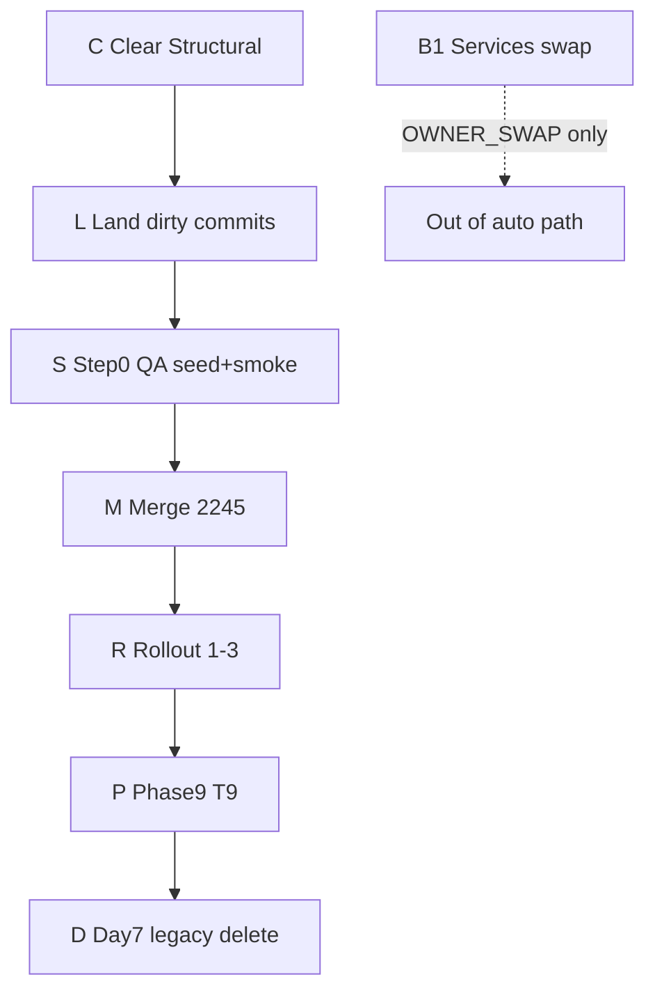

# Agenda V2 + leftovers — AUTO-RUN execution plan

Audience: implementing agent (Cursor Auto). Owner: Oran.  
Written: 2026-09-24 (evening). Supersedes the leftover chat list and refreshes [`FINAL-LINE-EXECUTION-PLAN.md`](./FINAL-LINE-EXECUTION-PLAN.md) truth.

**Kick phrase (owner → agent):** `auto-run the plan` / `start AUTO-RUN`.  
**Stop phrases:** `pause`, `stop auto-run`, `swap` (unlocks B1 only).

Parents: [`POST-AUDIT-EXECUTION-PLAN.md`](./POST-AUDIT-EXECUTION-PLAN.md), [`ROLLOUT.md`](./ROLLOUT.md), CURSOR §6 DoD. Services live swap stays **out** until owner says **`swap`**.

---

## 0. Auto-run contract (read once)

### 0.1 Goal of one Auto session

Land everything that is **agent-autonomous** through **Wave M (merge #2245)** and as far into Waves S / R as env + credentials allow, without asking clarifying questions. Pause only on a **HARD PAUSE** row below.

### 0.2 Non-negotiables (never soft-bypass)

| Rule | Enforcement |
|---|---|
| Branch `feat/tc-phase0` until #2245 merges; then short PRs off `main` | No commits on `main` |
| `cd web && npm run typecheck && npm run lint` before every commit | Never raw `tsc` / `eslint` |
| No live Jor writes (`f048e578-…`) until owner Step 3 read-only sign-off | Hard pause |
| Never commit `.env.local`, `.tmp-migrations-park/`, parked fake-timestamp SQL | `git status` gate |
| Do not hand-push `production`; pointer advances on green CI | Smoke after pointer only |
| Services `#servicios` P7 only after explicit owner **`swap`** | Hard pause B1 |
| Create / prove / delete QA only for destructive DB / CMS probes | No orphan QA |

### 0.3 HARD PAUSE tokens (agent stops and waits)

| Token | When | What agent does while paused |
|---|---|---|
| **OWNER_MERGE** | #2245 green + mergeable but repo policy wants human merge click | Post PR URL + green check summary; do not `gh pr merge` unless owner already said “merge it” |
| **OWNER_FLAG_BETA** | Before setting Production `TALENT_AGENDA_V2=talents` + beta UUID list | Prepare exact env values + UUID list draft; wait |
| **OWNER_FLAG_ALL** | Before `TALENT_AGENDA_V2=all` | Same |
| **OWNER_JOR_RO** | Before any Jor allow-list / live Jor session | Prepare read-only checklist; agents write **nothing** to her rows |
| **OWNER_SWAP** | Services B1 live band | Entire B1 blocked until message contains `swap` |
| **DAY_7_LEGACY** | ROLLOUT Step 4 earliest date | Calendar wait; do not delete legacy early |

If owner message includes `auto-run` **and** `merge it`, treat **OWNER_MERGE** as cleared for that turn.

### 0.4 Soft blockers — pre-cleared auto-bypass (do not stop)

| Blocker | Observed | Auto action |
|---|---|---|
| **Admin bundle ≤ ceiling by N KB** | Latest Structural: over by **~3.7 KB** @ `6ea94d3b` | Raise `web/scripts/app-bundle-budget.baseline.json` `admin.maxBytes` by `overage + 4 KB` headroom in the **same commit** that spends it; update `measuredBytes` + `why` (“Agenda V2 shell + Confirm transfer / TradeSections i18n”). Prefer `--record` after `npm run build` when machine can afford it; else arithmetic raise from CI log is allowed for ≤16 KB deltas |
| **Unchecked Supabase-read ratchet** | Fixed once; may recur on new agenda writers | Prefer real `error` handling; annotate only when empty≡failed; delete baseline entry when count → 0; never inflate silently |
| **Duplicate ES i18n keys (TS1117)** | Fixed in `6ea94d3b` | On recurrence: delete duplicate keys; re-gate |
| **Talent Website E2E / “Local Supabase + migration chain” red** | Flaky journeys (timeouts, Web Office, embeds) — unrelated to Agenda | **Ignore for merge decision** of #2245 (same class as #2244). Do not burn the session fixing talent-website journeys unless Structural is green and owner asks |
| **`tsc-queue` thrash / multi-agent lock** | 30–45 min UN / KILLED 137 | One waiter only; if holder 0% CPU >15 min and dead owner file → reclaim lock per script rules; never bypass queue with raw `tsc` |
| **ESLint ENOENT under `test-results/.playwright-artifacts-*`** | Transient | `rm -rf web/test-results/.playwright-artifacts-*` then re-lint |
| **Playwright login 404 on `/auth/login`** | Wrong path | Use `/login` |
| **Raw `*.vercel.app` 404 Host not registered** | `agency_domains` gate | QA on `app.tulala.digital` / `app.local:3102` / aliased seeded host only |
| **V2 flag off on prod evidence** | Screens show legacy | Accept for A3.2 PNG presence; for Step 0 “real V2” use local allow-list QA id |
| **Full smoke skip without `QA_TALENT_*`** | Expected | Load from `.env.local` (never commit); if missing, seed password from seed script default and document in ROLLOUT note |
| **Next OOM / killed mid-smoke** | Parallel tsc + Next | Stop parallel typechecks; single `./scripts/dev.sh`; re-run smoke |
| **PR rebase conflicts** | main moved | Rebase `feat/tc-phase0` on `origin/main`; resolve favoring agenda honesty; re-gate; force-with-lease **only** on feature branch if already pushed rewrite is required — never on `main` |
| **Parked services migration** | `.tmp-migrations-park/20261231284000_services_rebuild.sql` | Leave parked; never restore into `supabase/migrations/` in this plan |
| **Dirty seed WIP already half-written** | `seed-talent-agenda-qa.mjs` modified | Finish W1.2 in that file; do not invent a second seed entrypoint unless file > budget |

### 0.5 Definition of done (whole plan)

1. #2245 merged; Production pointer advanced; `deploy:smoke` exit 0; **flag still `0`/unset until Wave R**.  
2. ROLLOUT Step 0 fully checked (including full Playwright smoke with QA creds).  
3. ROLLOUT Steps 1→2→3 completed (owner flags); Step 4 after DAY_7.  
4. CURSOR §6 polish (T9) green on QA data.  
5. Dirty tree clean of agenda leftovers; parked SQL still parked.  
6. B1 **not** done unless owner said `swap`.

---

## 1. Truth snapshot (start of auto-run)

| Item | State @ plan write |
|---|---|
| Branch / HEAD | `feat/tc-phase0` @ `6ea94d3b` (synced) |
| PR | [#2245](https://github.com/orantene/impronta-app/pull/2245) OPEN, MERGEABLE |
| Structural | **RED** — admin bundle **+3.7 KB** over ceiling |
| Talent Website E2E | RED (bypass for merge) |
| Track A Step 0 code | Landed (A0–A3 + residuals + evidence static test) |
| Dirty | `web/scripts/seed-talent-agenda-qa.mjs` (week fixtures WIP); `FINAL-LINE-…` / this plan untracked; `.tmp-migrations-park/` exclude |
| QA primary | `f9090640-e763-4f8c-8a0b-c2cc691defb2` — login `qa-agenda-jor@impronta.test` |
| Live Jor | `f048e578-…` — **never** on allow-list until OWNER_JOR_RO |
| Services B1 | Blocked on OWNER_SWAP |



---

## Wave C — Clear Structural (blocks merge) — **AUTO**

**Goal:** Structural quality gate green on tip of `feat/tc-phase0`.

### C.1 Bundle ceiling (do first)

1. Read latest failed job log for exact overage (currently **3.7 KB**).  
2. Edit `web/scripts/app-bundle-budget.baseline.json`:
   - `admin.maxBytes` ← current + overage + **4096** (minimum headroom).  
   - Refresh `why` with date + what spent the bytes.  
   - If local `npm run build` feasible under queue: `node scripts/app-bundle-budget.mjs --record` and commit recorded numbers instead.  
3. Commit: `chore: raise admin bundle ceiling for Agenda V2 shell (+NkB)`.

### C.2 Any other ratchet that goes red on same push

| Fail | Action |
|---|---|
| Unchecked supabase read | Fix/annotate + delete zeroed baseline entries |
| Hex / size / comment-satisfiable | Move baseline or fix assertion; same commit |
| `error TS1117` duplicate keys | Dedupe `agenda-i18n.ts` |
| Admin boot / fidelity / builder | Real fix — do not bypass |

### C.3 Push + watch

```
git push origin HEAD
# PATH must include ~/.local/bin for gh
gh pr checks 2245 --watch
```

**Soft-bypass:** Talent Website E2E red → continue.  
**Acceptance:** Structural = pass on the tip SHA.

---

## Wave L — Land dirty tree — **AUTO**

**Goal:** `git status` clean for agenda paths (parked SQL still untracked/ignored).

### L.1 Commits (split; do not one-ball)

| Order | Prefix | Paths |
|---|---|---|
| 1 | `chore/talent:` | `web/scripts/seed-talent-agenda-qa.mjs` (finish W1.2 fixtures **in this wave if already written**, else stub commit message notes “fixtures land in Wave S”) |
| 2 | `docs:` | `AUTO-RUN-EXECUTION-PLAN.md` (+ optional `FINAL-LINE-EXECUTION-PLAN.md` pointer: “superseded by AUTO-RUN”) |
| 3 | Only if still dirty | evidence PNGs / clickthrough script / ROLLOUT ticks |

### L.2 Exclude forever in this plan

- `.tmp-migrations-park/**`
- `.env.local`
- `qa-clickthrough-fail.png` unless used as a documented failure artifact

### L.3 Gate

```
cd web && npm run typecheck && npm run lint
```

**Acceptance:** Only parked SQL (optional) shows as `??`; branch pushed.

---

## Wave S — Step 0 QA for real — **AUTO** (local)

**Goal:** ROLLOUT Step 0 checkboxes true, including full Playwright smoke.

### S.1 Env (local only; never commit)

```
TALENT_AGENDA_V2=talents
TALENT_AGENDA_V2_TALENTS=f9090640-e763-4f8c-8a0b-c2cc691defb2
QA_TALENT_EMAIL=qa-agenda-jor@impronta.test
QA_TALENT_PASSWORD=<seed default / .env.local>
PLAYWRIGHT_BASE_URL=http://app.local:3102
```

### S.2 Seed week fixtures

Complete `seedWeekFixtures` in `seed-talent-agenda-qa.mjs`:

- Tagged titles `QA:agenda-v2 …` for `--reset`
- Confirmed booking overlapping `?agendaNow=2026-09-23T09:50:00`
- Hold + unpaid/request + transfer-awaiting + deliverable deadline as needed for Attention CTAs
- Shared ids for `agency_bookings` ↔ `talent_bookings` where agenda load expects them
- No fake Stripe money; payment honesty ranks unchanged

Run seed against linked remote with service role (existing script pattern).  
**Acceptance:** Attention + Today non-empty under pinned clock.

### S.3 Server + smoke

1. `./scripts/dev.sh` (Host `app.local:3102`).  
2. Kill competing typechecks if Next starves.  
3. `npx playwright test e2e/talent-agenda-smoke.spec.ts --workers=1 --retries=0`  
4. Optional: `node web/scripts/qa-agenda-clickthrough.mjs`  
5. Commit any **passing** refreshed PNGs under `docs/plans/program/evidence/today-calendar/`.  
6. Tick ROLLOUT Step 0 Playwright box; push.

**Soft-bypass:** If smoke remains red after 2 honest retries, file exact failing test names in ROLLOUT as `PARTIAL — smoke` and **still proceed to Wave M** once Structural is green (code already has A3.2 evidence static test). Do not infinite-loop.

**Acceptance:** Smoke green **or** documented PARTIAL with evidence PNGs + static test green.

---

## Wave M — Merge #2245 — **AUTO** until OWNER_MERGE

1. `git fetch origin && git rebase origin/main` (if behind); resolve; C+L gates; push.  
2. Confirm Structural green on tip.  
3. **If owner said `merge it` (alone or with auto-run):**  
   `gh pr merge 2245 --merge` (or squash if PR already configured — match repo default).  
4. **Else HARD PAUSE OWNER_MERGE** — print URL + “Structural green; E2E flaky bypassed; say `merge it`”.  
5. After merge: wait for `production` pointer / green main CI; `cd web && npm run deploy:smoke`.  
6. **Leave Vercel `TALENT_AGENDA_V2` unset/`0`.**

**Acceptance:** PR closed merged; smoke 0; flag off in Production.

---

## Wave R — ROLLOUT Steps 1–3 — **HARD PAUSE per step**

Agent prepares; owner (or owner+`auto-run` with explicit step unlock) executes env.

### R.1 Beta — OWNER_FLAG_BETA

Agent prepares:

- Proposed `TALENT_AGENDA_V2=talents`
- UUID list = QA primary + up to ~19 beta ids (**no** `f048e578-…`)
- Commands: set Vercel Production env → wait redeploy → `deploy:smoke` → `db:check`

Owner unlock phrase: `unlock beta` or paste final UUID list + `set beta`.  
Agent then applies env via Vercel MCP/CLI if credentials allow; else pastes exact values for owner paste.

Monitor note: 48h soft — agent does not block Wave P on wall-clock; records “beta armed at &lt;ts&gt;”.

### R.2 All — OWNER_FLAG_ALL

Unlock: `unlock all` / `set all`.  
Set `TALENT_AGENDA_V2=all`; keep rollback `=0` ready.

### R.3 Jor read-only — OWNER_JOR_RO

Unlock: `jor read-only ok`.  
Agent: open checklist only; **zero writes** to Jor rows; capture notes path under evidence if owner requests screenshots of her UI.

**Acceptance:** Flag `all` (or Jor on list); owner sign-off line in ROLLOUT.

---

## Wave P — Phase 9 polish (T9) — **AUTO** after R.1 armed (may parallel beta)

Runs on QA allow-list host; does not require `all`.

| ID | Work | Acceptance |
|---|---|---|
| T9.1 | Trade walk beauty/barber/chef/dancer/design via seeded kinds | No trade `if` in components; sections render |
| T9.2–4 | 390/360, 44px, sticky, EN/ES | Regressions fixed; evidence optional |
| T9.5 | Extend smoke: accept request, deposit→confirm, conflict alt, block undo, finish+cash, cancel refund, no-show, reschedule | Green on QA; screenshots committed |

Branch: `fix/agenda-t9-*` off post-merge `main` if #2245 already merged; else continue on `feat/tc-phase0` only for fixes needed to merge.

---

## Wave D — Legacy delete — **DAY_7_LEGACY**

**Earliest:** ≥7 days after R.2 (`all`) with no rollback.

Separate PR:

1. Remove `isAgendaV2` branches that still mount legacy Today/Calendar.  
2. Delete unused day-14 helpers only when unused.  
3. Keep `TALENT_AGENDA_V2=0` kill switch one more week unless owner says remove.  
4. Gate + merge + smoke.

**Acceptance:** CURSOR §6; legacy paths gone.

---

## Wave B1 — Services P7 live `#servicios` — **OWNER_SWAP only**

Out of auto path. When owner says **`swap`**:

1. Confirm fingerprint `f8156c9405` (or current plan fingerprint).  
2. Create QA band → prove Select books catalog sheet → delete QA.  
3. Swap live band; record post-swap fingerprint + evidence.  
4. On failure: restore path proven; incident note; no half-swap.

Until then: ignore Services rebuild parked SQL.

---

## 2. Auto-run loop (agent algorithm)

```
on "auto-run the plan":
  while true:
    if Structural red on #2245 tip → do Wave C → push → continue
    if agenda dirty (excl park) → do Wave L → push → continue
    if Step0 smoke not green and local server available → do Wave S → push → continue
    if #2245 open and Structural green:
      if owner unlocked merge → Wave M merge
      else HARD PAUSE OWNER_MERGE → stop
    if #2245 merged and flag still 0:
      if owner unlocked beta/all/jor → do that R step
      else start Wave P on QA (auto) OR HARD PAUSE next R token → stop only if P done and R pending
    if R.2 done and day>=7 → Wave D
    if message contains "swap" → Wave B1
    if DoD satisfied → stop success
```

**Never ask** “should I raise the bundle?” / “ignore E2E?” — already answered in §0.4.

---

## 3. Commit / PR message prefixes

| Surface | Use |
|---|---|
| `talent/` | Product Agenda behavior |
| `chore/` / `chore/talent:` | Seed, ceilings, ratchet baselines |
| `test:` | Smoke, static evidence, clickthrough |
| `docs/` | This plan, ROLLOUT ticks |
| `fix:` | Post-merge hotfixes |

---

## 4. Immediate next actions (first Auto turn after kick)

1. **C.1** Raise admin `maxBytes` by **3.7 KB + 4 KB** (≈ **7946** bytes) on current baseline `10108416` → **`10116362`** (or `--record` if build cheap).  
2. Commit + push.  
3. Watch Structural; ignore Talent Website E2E.  
4. **L.1** Commit seed WIP + this plan doc.  
5. **S.** Seed + smoke if machine free.  
6. When Structural green → pause for **`merge it`** unless already unlocked.

---

## 5. Explicitly out

- New product (packs, Tap to Pay, etc. per CURSOR §4)  
- Committing parked `services_rebuild` migration  
- Agent writes to live Jor  
- Force-push `main`  
- B1 without `swap`
