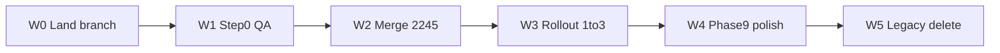

# Agenda V2 — Final-line execution plan

> **Superseded for execution:** use [`AUTO-RUN-EXECUTION-PLAN.md`](./AUTO-RUN-EXECUTION-PLAN.md) (blocker bypasses + auto-run loop). This file remains as narrative/background only.

Audience: implementing agent. Owner: Oran. Branch: continue [`feat/tc-phase0`](https://github.com/orantene/impronta-app/pull/2245) until #2245 merges, then short-lived branches off `main` for rollout/legacy. Do **not** edit [`CURSOR-EXECUTION-PLAN.md`](docs/plans/today-calendar/CURSOR-EXECUTION-PLAN.md). Parent contracts: [`POST-AUDIT-EXECUTION-PLAN.md`](docs/plans/today-calendar/POST-AUDIT-EXECUTION-PLAN.md), [`ROLLOUT.md`](docs/plans/today-calendar/ROLLOUT.md), CURSOR §6 DoD.

**Finish line (locked default):** Full program DoD from CURSOR §6 — screens live EN/ES at 1440/390/360 on real data, CTAs work E2E, derived numbers fixture-covered, flag `all`, legacy Today/Calendar paths removed after ≥7 days green. Services P7 live band swap stays **out** until owner says “swap.”

**Non-negotiables:** `cd web && npm run typecheck && npm run lint` before every commit; never raw `tsc`/`eslint`; no live Jor writes until Step 3 (read-only first); never commit `.env.local` or `.tmp-migrations-park/`; flag off leaves legacy unchanged until Step 4.



---

## Current state (truth)

| Item | State |
|---|---|
| PR [#2245](https://github.com/orantene/impronta-app/pull/2245) | OPEN; Track A Step 0 **code-claimed** complete |
| Migrations | Applied (`db:check` 869) |
| QA seed | Live: primary `f9090640-e763-4f8c-8a0b-c2cc691defb2` + kind shells; password login `qa-agenda-jor@impronta.test` |
| Local flag | `.env.local`: `TALENT_AGENDA_V2=talents` + QA UUID only (Jor off) |
| Uncommitted on branch | Seed fix, clickthrough script, ROLLOUT/post-audit docs, CTA/quote/i18n/TradeSections deltas, A3 tests, evidence PNGs |
| Playwright | Partial (login + Today for QA id observed); full smoke not green (Next killed mid-run) |
| ROLLOUT 1–4 / Phase 9 T9.* | Not done |
| Services B1 | Out of this plan |

---

## Wave 0 — Land the branch (same day)

**Goal:** Dirty tree becomes reviewable commits on #2245.

1. **Inventory & split commits** (do not one-ball of mud):
   - `chore/talent:` seed script schema fix — [`web/scripts/seed-talent-agenda-qa.mjs`](web/scripts/seed-talent-agenda-qa.mjs)
   - `test:` [`web/scripts/qa-agenda-clickthrough.mjs`](web/scripts/qa-agenda-clickthrough.mjs) + evidence PNGs under [`docs/plans/program/evidence/today-calendar/`](docs/plans/program/evidence/today-calendar/) (exclude `qa-clickthrough-fail.png` unless useful as failure artifact)
   - `talent/:` CTA/i18n/TradeSections/attention/create-quote deltas
   - `test:` A3 honesty/evidence static tests
   - `docs/:` [`ROLLOUT.md`](docs/plans/today-calendar/ROLLOUT.md), [`POST-AUDIT-EXECUTION-PLAN.md`](docs/plans/today-calendar/POST-AUDIT-EXECUTION-PLAN.md) status only
2. **Exclude:** `.tmp-migrations-park/`, `.env.local`, any parked SQL with fake timestamp.
3. **Gate:** `cd web && npm run typecheck && npm run lint`; push `feat/tc-phase0`.
4. **Acceptance:** `git status` clean for agenda paths; PR diff matches intended Wave 0 files only.

---

## Wave 1 — Close Step 0 for real (blocks beta)

**Goal:** ROLLOUT Step 0 fully checked; A3.2 satisfied.

### W1.1 Keep local allow-list honest

```
TALENT_AGENDA_V2=talents
TALENT_AGENDA_V2_TALENTS=f9090640-e763-4f8c-8a0b-c2cc691defb2
QA_TALENT_EMAIL=qa-agenda-jor@impronta.test
QA_TALENT_PASSWORD=<from .env.local / seed default>
```

Never add `f048e578-…` (live Jor).

### W1.2 Seed week fixtures (today is shell-only)

Extend [`seed-talent-agenda-qa.mjs`](web/scripts/seed-talent-agenda-qa.mjs) (or a sibling `seed-talent-agenda-qa-week.mjs`) to write **only** for tagged QA talents:

- Confirmed booking overlapping clock `2026-09-23T09:50:00-05:00`
- Hold, unpaid request, overdue/transfer-awaiting, agency mirror row as needed for Attention/Today
- Deliverable deadline in range (proves A1.3)

Reuse existing create paths / shape from [`create-slot.ts`](web/src/lib/talent-agenda/create-slot.ts) and load mappers — no invented commercial lies. Tag with `QA:agenda-v2` for `--reset`.

**Acceptance:** `?agendaNow=2026-09-23T09:50:00` shows Attention + Today cards with real CTAs (not empty first-day only).

### W1.3 Stable local server + click-through

1. `./scripts/dev.sh` (needs `app.local:3102`; Host matters — bare `127.0.0.1` is not the talent vanity path).
2. Avoid parallel CPU-killer / parallel `tsc` while Next is up.
3. Run:
   - `node scripts/qa-agenda-clickthrough.mjs` with `PLAYWRIGHT_BASE_URL=http://app.local:3102`
   - `npx playwright test e2e/talent-agenda-smoke.spec.ts` with `QA_TALENT_*` set
4. Commit passing screenshots (`today-desktop`, `calendar-desktop`, journeys, 390/360).
5. Check the Playwright box in [`ROLLOUT.md`](docs/plans/today-calendar/ROLLOUT.md).

**Acceptance:** Smoke green locally; evidence PNGs in repo; fail PNG not the only artifact.

### W1.4 Doc honesty

Confirm GAP/POST-AUDIT stamps match reality (already demoted where needed). Step 0 residual claim stays accurate.

---

## Wave 2 — Merge #2245

1. Rebase on latest `origin/main` if behind; resolve; gate; push.
2. CI Structural green on the tip commit.
3. Owner merge to `main` (preview deploy). Production pointer advances only on green CI — do not hand-push `production`.
4. After pointer: `cd web && npm run deploy:smoke`.
5. **Leave Vercel `TALENT_AGENDA_V2` unset/`0` until Wave 3** (code on main, flag still off for all live talents).

**Acceptance:** #2245 merged; smoke 0; flag still off in Production.

---

## Wave 3 — ROLLOUT Steps 1–3 (owner-gated)

Execute only after Wave 1–2 green. Checklist before each step: typecheck/lint already on main; `deploy:smoke`; one internal session.

### Step 1 — Beta (~20 talents)

1. Vercel Production: `TALENT_AGENDA_V2=talents`
2. `TALENT_AGENDA_V2_TALENTS=<comma UUIDs>` — QA + chosen beta; **no Jor**
3. `db:check` clean; smoke after redeploy
4. Monitor 48h (Today, Calendar, booking record feedback)

### Step 2 — Full

1. `TALENT_AGENDA_V2=all`
2. Keep flag-off rollback ready (`TALENT_AGENDA_V2=0`) for ≥7 days

### Step 3 — Jor demo

1. Add Jor id **or** rely on `all`
2. **Read-only:** owner clicks; agents write nothing to her rows
3. Capture owner PDF-vs-live notes; fix only honesty/regressions that block Step 4

**Acceptance:** Flag `all` (or Jor on allow-list); owner sign-off recorded; no agent Jor writes.

---

## Wave 4 — Master Phase 9 closeout (T9 remaining)

Phases 0–8 UI/backend largely shipped behind the flag. Wave 4 closes CURSOR Phase 9 gaps that Step 0 smoke does not cover.

### T9.1 Trade walk

Walk beauty / barber / chef / dancer / design via seeded kind talents + `TRADE_PROFILES`. Fix only via registry / section renderers — no trade `if` in components.

### T9.2–T9.4 Mobile / a11y / i18n

Re-verify 390/360, 44px targets, sticky bars, tab hide on focused flows, chip text, EN+ES catalog (`verify:ui-messages` if keys used). Fix regressions only.

### T9.5 Full journey E2E (extend smoke)

Against QA seed, implement/keep green:

- accept request → Today count drops
- deposit request → simulated webhook → Confirmed
- New booking conflict → pick alternative → saved
- block time → Undo
- finish + collect cash → receipt
- cancel with refund
- no-show after start
- reschedule with fee (accept + conflict)

Screenshots → evidence folder. Prefer extending [`e2e/talent-agenda-smoke.spec.ts`](web/e2e/talent-agenda-smoke.spec.ts) over a second parallel suite.

**Acceptance:** T9.5 journeys pass on QA host or local `app.local`; evidence committed.

---

## Wave 5 — ROLLOUT Step 4 (legacy delete)

**Earliest:** ≥7 days after Step 2 with no flag-off traffic / no rollback.

Separate PR off `main`:

1. Remove `isAgendaV2` branches that still render legacy `TalentTodayPage` / `CalendarPage` for agenda routes ([`talent.tsx`](web/src/components/admin/shell/internal/talent.tsx) / layout bridge).
2. Delete unused legacy day-14 helpers only after confirmed unused.
3. Keep `TALENT_AGENDA_V2` read for one release as hard-off kill switch **or** remove after owner OK — default: keep `0` kill switch one more week, then delete flag helpers in a tiny follow-up.
4. Gate + merge; smoke; monitor.

**Acceptance:** CURSOR §6 — flag effectively on for all; old Today/Calendar paths gone; smoke green.

---

## Explicitly out of this plan

- Services P7 `#servicios` live swap (needs owner “swap”)
- Committing parked migrations / prototype HTML/PDF
- Writing to live Jor before Step 3
- New product surfaces listed in CURSOR §4 (packs, Tap to Pay, etc.)

---

## Agent runbook (copy order)

```
W0  Commit/push leftovers on feat/tc-phase0 (split commits)
W1.2 Seed week fixtures for QA talent
W1.3 app.local clickthrough + playwright smoke + evidence
W1.4 Check ROLLOUT Step 0 boxes
W2  Rebase, CI green, merge #2245, deploy:smoke; flag stays 0 in Vercel
W3.1 Owner: Vercel talents + beta UUIDs; 48h
W3.2 Owner: TALENT_AGENDA_V2=all
W3.3 Owner: Jor read-only click-through
W4  T9.1–T9.5 polish + journey E2E
W5  After ≥7d: legacy delete PR
```

**Definition of done for this plan:** Waves 0–5 complete; CURSOR §6 satisfied; ROLLOUT Steps 0–4 checked; #2245 merged; Production on Agenda V2 for all talents; legacy paths removed; no unauthorized Jor writes.