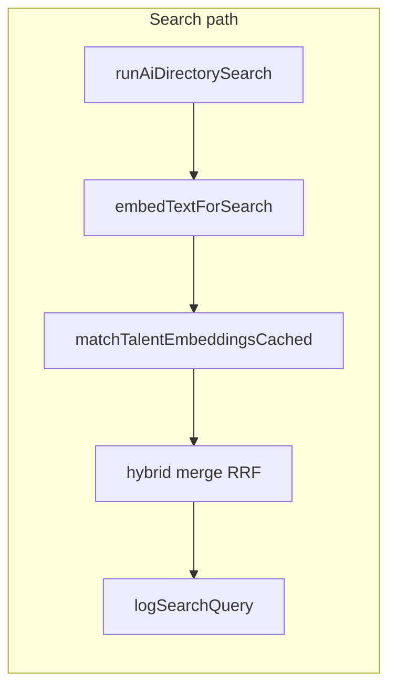

# Post-revisions roadmap (quality + stabilization)

**Document pairing**

- **Planning source (Cursor):** `.cursor/plans/post-revisions_roadmap_408262a2.plan.md` — use for iteration in Cursor; keep this repo file aligned when the roadmap **structure or gates** change.
- **Repo reference (this file):** What developers and other docs link to. Do not churn wording unless product or shipped reality changes.

After CMS revisions, the platform is in **iteration mode**: no missing architecture for CMS, AI surfaces, or admin tools. Remaining work is scoped below.

---

## 1. Search tuning (largest bucket)

**Intent:** Tune hybrid relevance, cursors, observability at scale, RRF, evals, and cost/latency—without changing the public DTO contract or classic fallback.

| Theme | Primary touchpoints |
|--------|---------------------|
| Hybrid merge / RRF / candidate blending | [web/src/lib/ai/hybrid-merge.ts](../web/src/lib/ai/hybrid-merge.ts), [web/src/lib/ai/run-ai-directory-search.ts](../web/src/lib/ai/run-ai-directory-search.ts), env knobs in [search-performance-budget.md](search-performance-budget.md) / [ranking_signals.md](ranking_signals.md) |
| Semantic / hybrid cursor | [web/src/lib/directory/cursor.ts](../web/src/lib/directory/cursor.ts), [web/src/lib/directory/hybrid-context-stamp.ts](../web/src/lib/directory/hybrid-context-stamp.ts), [search-modes.md](search-modes.md) |
| Fallback + large `search_queries` rollups | [web/src/lib/search-queries/log-search-query.ts](../web/src/lib/search-queries/log-search-query.ts); staff aggregates in [web/src/lib/ai/ai-console-metrics.ts](../web/src/lib/ai/ai-console-metrics.ts) via RPC `search_queries_fallback_reason_rollup` (migration `20260422120000_search_queries_fallback_reason_rollup.sql`), with **sampled** fallback if the RPC is unavailable. |
| Evaluation harness | [web/scripts/eval-search.ts](../web/scripts/eval-search.ts), [eval/search-eval-set.json](../eval/search-eval-set.json), [search-eval-set.md](search-eval-set.md) |
| Latency / cost | [web/src/lib/ai/openai-embeddings.ts](../web/src/lib/ai/openai-embeddings.ts), [web/src/lib/ai/vector-neighbor-cache.ts](../web/src/lib/ai/vector-neighbor-cache.ts), [web/src/middleware.ts](../web/src/middleware.ts), [ai-api-efficiency.md](ai-api-efficiency.md) |

**Success signals:** Better offline eval metrics, lower p95 for `/api/ai/search` under load, clearer operator view of fallback reasons at volume (console or DB).

**Stop condition (endless tuning guard):** Declare search tuning **done** for this track when all of the following hold (thresholds are team-defined and written down, e.g. in [search-eval-set.md](search-eval-set.md) or [decision-log.md](decision-log.md)):

- **Eval harness stable** — fixed eval set + runner produce repeatable numbers; no flaky steps.
- **Fallback rate acceptable** — aggregate `fallback_triggered` / volume (or equivalent) within agreed bound for representative traffic.
- **p95 latency acceptable** — `/api/ai/search` (and embedding path if measured) within agreed budget vs [search-performance-budget.md](search-performance-budget.md).
- **No regressions vs v2-off baseline** — with `ai_search_quality_v2` (and related flags) off, behavior matches agreed baseline (classic ordering, no worse relevance on eval slice).

Further tweaks after that are optional or a new iteration with new targets.

---

## 2. Refine improvements

**Intent:** Keep chips mapped to real filter params; add context (location, availability, ranges) and better ranking.

| Theme | Primary touchpoints |
|--------|---------------------|
| Core logic | [web/src/lib/ai/refine-suggestions.ts](../web/src/lib/ai/refine-suggestions.ts), [web/src/app/api/ai/refine-suggestions/route.ts](../web/src/app/api/ai/refine-suggestions/route.ts) |
| Client payload / dedupe | Directory discover / infinite (e.g. [web/src/components/directory/directory-discover-section.tsx](../web/src/components/directory/directory-discover-section.tsx)) |
| Data sources | `locations`, [web/src/lib/directory/taxonomy-filters.ts](../web/src/lib/directory/taxonomy-filters.ts), `field_values` where availability exists (per product rules) |

---

## 3. Explanation improvements

**Intent:** Richer rules, clearer public confidence, ordering caps per surface.

| Theme | Primary touchpoints |
|--------|---------------------|
| Rules + ordering | [web/src/lib/ai/match-explain.ts](../web/src/lib/ai/match-explain.ts), [web/src/lib/ai/build-ai-search-explanations.ts](../web/src/lib/ai/build-ai-search-explanations.ts) |
| Public UI | Directory components under [web/src/components/directory](../web/src/components/directory) consuming `SearchResult.explanation` / confidence; optional **list view** parity |
| Docs | [match_explanations.md](match_explanations.md), [ai-confidence-model.md](ai-confidence-model.md) (if present) |

---

## 4. Final stabilization closeout (ship gate)

**Intent:** Unambiguous end of track—a **gate** before calling the program stable.

**Gate — all required:**

- **No open P0 / P1 bugs** for in-scope surfaces (directory AI, refine, explanations, inquiry AI, CMS critical paths as you define).
- **Release playbook exercised** — at least one dry run or real deploy following [ai-release-playbook.md](ai-release-playbook.md) (checklist completed, not only read).
- **Retention policy confirmed** — [ai-data-retention.md](ai-data-retention.md) + `search_queries` / AI data handling agreed with stakeholders.
- **Acceptance checklist reconciled** — [acceptance-checklist.md](acceptance-checklist.md) aligned with [execution-plan.md](execution-plan.md) and shipped reality (stale boxes updated or explicitly deferred).
- **Migrations and env documented** — required migrations named, embed worker / OpenAI / Supabase keys and tunables listed for prod (playbook, README, or deploy doc).

**Supporting work (feeds the gate):**

| Item | Where |
|------|--------|
| QA matrix | Smoke path coverage (auth, directory AI/refine, inquiry draft, CMS publish, redirects); acceptance checklist or short QA doc |
| Production readiness notes | Rate limits, monitoring hooks, rollback — playbook / [decision-log.md](decision-log.md) |

---

## Optional (explicitly not required now)

Personalization, learning loop, conversational / multi-query search: **no plan** until product commits.

---

## Recommended order

1. **Search tuning** first — metrics-driven; **stop when §1 stop condition is met** (not open-ended).
2. **Refine vs explanations — not fully parallel by default** (same person should not edit the same ranking/explanation surfaces simultaneously):
   - **Refine first** if the logic depends on **explanation-informed ranking**.
   - **Explanations first** if **refine** depends on **richer explanation signals** (new codes, DTO fields, or ordering rules refine will consume).
   - **Otherwise**, limited parallel work is OK only when **ownership is separate** (different people or clearly disjoint files/contracts).
3. **Stabilization closeout** — run as the **§4 gate**; the track is not “done” until every gate item is satisfied.

No architecture gaps remain; this is **measure → adjust → document → ship**, with explicit exit criteria so the tail does not sprawl.
