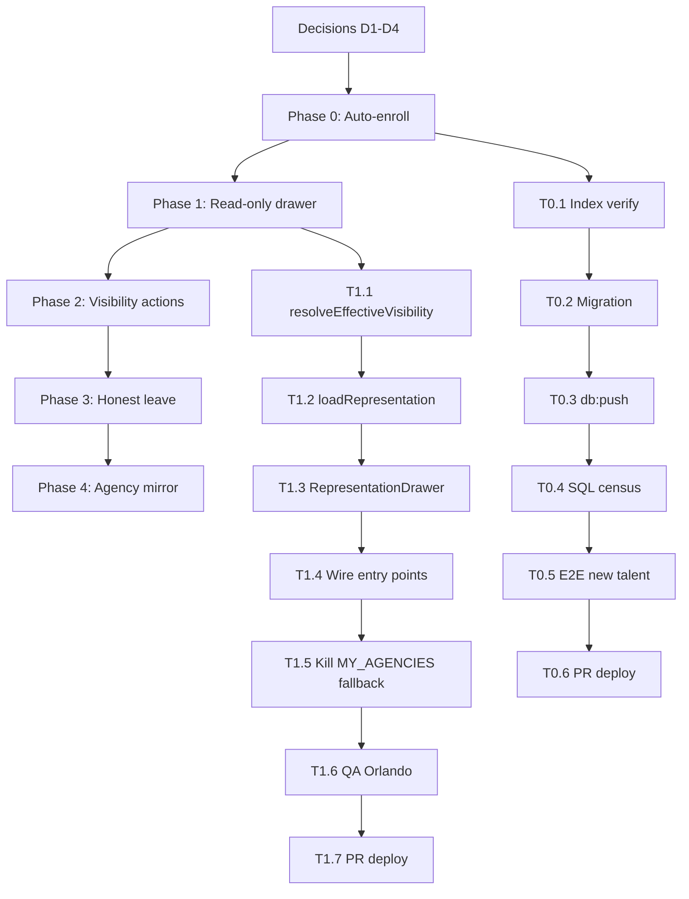

# Representation Engine — execution plan & runnable tasks

**Status:** ready to run · **Date:** 2026-06-05 · **Spec:** [`representation-engine-spec-2026-06-05.md`](./representation-engine-spec-2026-06-05.md)

> Each task below is self-contained: branch setup, files to touch, commands to run, and how to prove it worked. Pick **one phase per agent/session**. Never `git switch` in the shared checkout — use a worktree.

---

## Locked decisions (spec §12 defaults — override before Phase 0 if needed)

| # | Decision | Locked choice | Override? |
|---|----------|---------------|-----------|
| D1 | Auto-enroll gate | Enroll on `workflow_status IN ('approved','published')` only (DB trigger on insert + update of workflow_status) | |
| D2 | Leave grace period | Immediate `removed` + honest pause/resume; **no** fake 14-day countdown | |
| D3 | Drawer shape | Accordion per tenant (collapsed chips → expand for actions) | |
| D4 | Override notifications (Phase 4) | Defer — agency mirror only; no email/in-app notifications in v1 | |

---

## Global prerequisites (every phase)

### Read first (once per agent)

```bash
# Spec + this plan
cat web/docs/representation-engine-spec-2026-06-05.md
cat web/docs/representation-engine-plan-2026-06-05.md

# Memory (hub routing, QA accounts)
cat ~/.claude/projects/-Users-oranpersonal-Desktop-impronta-app/memory/project_tulala_enterprise_hub.md
cat ~/.claude/projects/-Users-oranpersonal-Desktop-impronta-app/memory/reference_qa_credentials.md
```

### Worktree bootstrap (per phase — replace `<branch>` and `<dir>`)

```bash
cd /Users/oranpersonal/Desktop/impronta-app
git fetch origin main
git worktree add /Users/oranpersonal/Desktop/<dir> -b <branch> origin/main
cd /Users/oranpersonal/Desktop/<dir>/web
npm install   # optional if relying on Vercel PR build for tsc
```

### Pre-commit gate

```bash
cd web && npx tsc --noEmit && npm run lint
```

If worktree has no `node_modules`, rely on green **Vercel PR build** instead. Ignore standalone `tsc` `react/jsx-runtime` false positives on single files.

### Migration protocol (any phase with SQL)

```bash
# Unique timestamp at start of work
date -u +%Y%m%d%H%M%S

# Apply to remote Supabase BEFORE merging code that depends on it
cd web && npm run db:push
cd web && npm run db:check   # must show no drift
```

### Deploy to production (after merge to `main`)

```bash
cd web && npm run deploy:promote && npm run deploy:smoke
# If promote times out mid-poll, finish aliases manually:
# npx vercel alias set <deploy-url> tulala.digital --scope oran-tenes-projects
# npx vercel alias set <deploy-url> app.tulala.digital --scope oran-tenes-projects
```

### Baseline DB census (run before Phase 0 and after each phase)

```sql
-- Talents approved/published but with NO public roster (should trend → 0 after Phase 0)
SELECT count(*) FROM talent_profiles tp
WHERE tp.deleted_at IS NULL AND tp.workflow_status IN ('approved','published')
  AND NOT talent_has_public_roster(tp.id);

-- Orlando effective visibility ground truth (TAL-92026)
SELECT a.display_name, a.kind, r.status, r.agency_visibility, r.talent_site_hidden, r.is_primary
FROM agency_talent_roster r
JOIN agencies a ON a.id = r.tenant_id
JOIN talent_profiles tp ON tp.id = r.talent_profile_id
WHERE tp.profile_code = 'TAL-92026' AND r.status != 'removed'
ORDER BY r.is_primary DESC, a.kind DESC, a.display_name;
```

Supabase project: `pluhdapdnuiulvxmyspd` (MCP `execute_sql` or dashboard).

### QA accounts

| Role | Account | Notes |
|------|---------|-------|
| Talent (5 rosters) | Orlando / TAL-92026 | Tulala=live; 3 agencies=roster_only |
| Hub owner | orantene@gmail.com | |
| Hub admin | qa-admin@impronta.test | Password in `reference_qa_credentials.md` |
| Local sign-in | `/api/dev/signin` | Agents cannot type passwords into login forms |

### Routing sanity (run once)

```bash
curl -sD - -o /dev/null "https://tulala.digital/directory" | grep -i x-matched-path
# expect: /global-directory

curl -sD - -o /dev/null "https://tulala.digital/t/TAL-92026" | grep -E 'HTTP/|x-matched-path'
# expect: 200, /t/[profileCode]
```

---

## Phase 0 — Auto-enroll (URGENT, ship alone)

**Branch:** `feat/representation-phase-0-auto-enroll`  
**Worktree:** `/Users/oranpersonal/Desktop/representation-p0`  
**Depends on:** D1 locked  
**Blocks:** Phases 1–4 (new talents 404 without this)

### Tasks

#### T0.1 — Verify partial unique index name

```bash
rg "agency_talent_roster_tenant_talent_live" supabase/migrations/
```

Confirm index `agency_talent_roster_tenant_talent_live_uniq` exists (`WHERE status IN ('pending','active','inactive')`). If `ON CONFLICT` can't target it, use `WHERE NOT EXISTS` guard in trigger instead.

#### T0.2 — Write migration

**File:** `supabase/migrations/<TS>_auto_enroll_talent_into_platform_hub.sql`

Copy trigger from spec §4 Option A:

- `ensure_talent_in_platform_hub()` — SECURITY DEFINER, resolves hub via `kind='hub' AND plan_tier='network' AND status='active'`
- Gate: `workflow_status IN ('approved','published')` and `deleted_at IS NULL`
- Insert: `source_type='platform_assigned'`, `status='active'`, `agency_visibility='site_visible'`, `talent_site_hidden=false`, `is_primary=false`
- Trigger: `AFTER INSERT OR UPDATE OF workflow_status ON talent_profiles`
- Backfill `INSERT … SELECT` for talents missing a live hub row (safe to re-run)

**Do not** hardcode hub UUID in app code; SQL backfill may use the known hub id `40081ec3-5ca8-43a0-b50b-31c927b2716b` or subquery `SELECT id FROM agencies WHERE kind='hub' AND plan_tier='network' LIMIT 1`.

#### T0.3 — Apply migration

```bash
cd web && npm run db:push
cd web && npm run db:check
```

#### T0.4 — Verify trigger on prod

```sql
-- Census should be 0 (or explain any exceptions)
SELECT count(*) FROM talent_profiles tp
WHERE tp.deleted_at IS NULL AND tp.workflow_status IN ('approved','published')
  AND NOT talent_has_public_roster(tp.id);

-- Simulate: pick a draft talent, approve it, confirm hub row appears
-- (or create test talent via existing provision flow)
```

#### T0.5 — Smoke new talent end-to-end

1. Create or approve a **new** talent (not in the one-time batch).
2. Confirm hub roster row:

```sql
SELECT r.* FROM agency_talent_roster r
JOIN talent_profiles tp ON tp.id = r.talent_profile_id
JOIN agencies a ON a.id = r.tenant_id
WHERE tp.profile_code = '<NEW_CODE>' AND a.kind = 'hub';
```

3. `curl -s -o /dev/null -w "%{http_code}" "https://tulala.digital/t/<NEW_CODE>?cb=$(date +%s)"` → **200**
4. Set `is_discoverable=true` if needed; run `SELECT refresh_talent_discover_index();`; wait ≤15 min or bust cache; confirm in `/directory`.

#### T0.6 — PR + deploy

```bash
cd web && npx tsc --noEmit && npm run lint
git add supabase/migrations/<TS>_auto_enroll_talent_into_platform_hub.sql
git commit -m "feat(api): auto-enroll approved talents into platform hub"
git push -u origin feat/representation-phase-0-auto-enroll
gh pr create --title "Representation Phase 0: auto-enroll hub roster" --body "$(cat <<'EOF'
## Summary
- DB trigger enrolls approved/published talents into Tulala hub with site_visible roster
- Backfill for any talents still missing a live hub row

## Test plan
- [ ] Census query returns 0 invisible approved talents
- [ ] New approved talent has hub row + /t/<code> returns 200
- [ ] deploy:smoke green after promote
EOF
)"
# Merge PR → then:
cd web && npm run deploy:promote && npm run deploy:smoke
```

### Phase 0 acceptance

- [ ] Approved talent auto-gets active `site_visible` hub row
- [ ] `/t/<code>` returns 200 (premium template)
- [ ] Directory shows talent after matview refresh
- [ ] `deploy:smoke` green, no migration drift

---

## Phase 1 — Read-only unified drawer

**Branch:** `feat/representation-phase-1-drawer`  
**Worktree:** `/Users/oranpersonal/Desktop/representation-p1`  
**Depends on:** Phase 0 merged (recommended, not strictly required for UI)

### Tasks

#### T1.1 — `resolveEffectiveVisibility` + unit tests (build first)

**Files:**

- `web/src/lib/talent/representation.ts` — types + `resolveEffectiveVisibility()` per spec §2
- `web/src/lib/talent/representation.test.ts` — every branch + precedence (global > per-roster; removed > all)

```bash
cd web && npx vitest run src/lib/talent/representation.test.ts
cd web && npx tsc --noEmit && npm run lint
```

#### T1.2 — `loadRepresentation` loader

**Goal:** Return `RepresentationEntry[]` + `{ globalHidden }` per spec §3.1.

- Join `agency_talent_roster` → `agencies` where `status != 'removed'`
- Order: primary first, then `kind='hub'`, then name
- Prepend `self_page` entry (kind `self_page`, tulala.digital/t/<code>)
- Compute `effective` via `resolveEffectiveVisibility`
- Compute `publicUrl` via `agency-roster-profile-url.ts` (extend for hub/self per spec §5.4)
- Wire into talent data-bridge consumed by `useAdminShell().bridgeTalentAgencies`

**Files to inspect/extend:**

- `web/src/components/admin/shell/internal/data-bridge.ts`
- `web/src/lib/talent/agency-roster-profile-url.ts`
- `web/src/lib/saas/platform-hub.ts` (`getPlatformHubTenant` — never hardcode hub UUID)

If RLS blocks cross-tenant agency reads, add SECURITY DEFINER RPC `talent_representation_for_self(p_talent_profile_id)` (mirror `talent_has_public_roster` pattern).

#### T1.3 — `RepresentationDrawer` (read-only)

**Files:**

- `web/src/components/admin/shell/internal/talent-drawers/representation.tsx` — **new**
- `web/src/components/admin/shell/internal/talent-drawers.tsx` — register `"representation"`

**UX (D3 accordion):**

- Collapsed row: logo, name, kind badge, plan badge, effective chip, publicUrl + copy, chevron
- Expanded: info block only (no actions yet) — joined date, take-rate, primary, exclusivity, "what this agency can do" copy from `agency.tsx`
- Top: global hidden **display only** (no toggle yet)
- Filter out `effective === 'removed'`
- Props: `actor: "talent" | "agency"` (talent only in Phase 1), optional `focusAgencyId` to auto-expand one row

Chip copy per spec §5.2 table.

#### T1.4 — Wire 3 entry points

| Entry | File | Change |
|-------|------|--------|
| My pages → Where you appear | `talent/pages/SettingsPage.tsx` | `openDrawer("representation")` / `{ focusAgencyId }` |
| Money → Your agencies | `MoneyAgencyCards.tsx` | Repoint from `talent-agency-relationship` → `representation` |
| Settings → visibility | `ProfileVisibilityDrawer.tsx` or settings card | `openDrawer("representation")` |

Keep `TalentAgencyRelationshipDrawer` + `ProfileVisibilityDrawer` alive until Phase 2 parity.

#### T1.5 — Kill fixture fallback in Money cards (read path)

**File:** `web/src/components/talent/money/MoneyAgencyCards.tsx`

- Remove `MY_AGENCIES` fallback when `bridgeTalentAgencies` is null — show empty/loading state instead
- Same audit for `SettingsPage.tsx` `MY_AGENCIES` fallback

#### T1.6 — Verify Orlando (TAL-92026)

**Expected 5 entries:**

1. Self page
2. Tulala hub → chip **🟢 Live**
3. Impronta → **🔴 Agency isn't showing you** (`roster_only`)
4. Hotels Express → same
5. QA Test 27 → same

Open drawer from `/talent/money`, My pages, Settings → **identical list**.

#### T1.7 — PR + deploy

```bash
cd web && npx tsc --noEmit && npm run lint
# (+ vitest if tests added)
git push -u origin feat/representation-phase-1-drawer
gh pr create ...
# merge → deploy:promote && deploy:smoke
```

### Phase 1 acceptance

- [ ] Unit tests pass for all `EffectiveVisibility` branches
- [ ] Orlando shows 5 entries with correct chips
- [ ] Same drawer from all 3 entry points
- [ ] No `MY_AGENCIES` fixture rows in prod paths
- [ ] Vercel build green

---

## Phase 2 — Visibility + primary actions

**Branch:** `feat/representation-phase-2-actions`  
**Worktree:** `/Users/oranpersonal/Desktop/representation-p2`  
**Depends on:** Phase 1 merged

### Tasks

#### T2.1 — Server actions (talent mode)

**File:** `web/src/lib/server-actions/talent-self-profile-sections.ts`

| Action | Status |
|--------|--------|
| `selfSetRosterVisibility({ talent_profile_id, agency_id, hidden })` | Lift from `[tenantSlug]/talent/settings/actions.ts` ~L126 |
| `selfSetGlobalHidden({ talent_profile_id, hidden })` | Confirm exists; wire to drawer |
| `selfSetPrimaryAgency` | Already exists — wire |
| All guarded by `requireTalentSelfAction` | Required |

Return `{ ok: true } | { ok: false, error }`; `logServerError` on failure; refresh bridge on success. **Never** `toast("… (demo)")`.

#### T2.2 — Drawer actions UI

**File:** `representation.tsx`

- Global switch: `is_publicly_hidden` with warning (overrides all rosters)
- Per-roster eye toggle → `selfSetRosterVisibility`
  - Disabled + red helper when `agency_visibility === 'roster_only'`
  - Disabled when `globalHidden` with helper *"You're hidden everywhere — turn that off first."*
- Set as primary (hide for `self_page` and already-primary)
- Preview / Visit link (opens `publicUrl` in new tab)

#### T2.3 — Directory latency copy

After visibility mutations, show helper: *"Changes appear in search within ~15 min"* (matview + 120s cache — spec §6).

Optional: call `refresh_talent_discover_index()` RPC after mutation (server-side).

#### T2.4 — Live verify hide toggle

1. Orlando: hide on Tulala (live row)
2. `curl "https://tulala.digital/t/TAL-92026?cb=$(date +%s)"` → profile delisted / 404 per gate
3. Unhide → 200 again
4. Global hide → all per-roster toggles disabled in UI

#### T2.5 — PR + deploy

Same gate/PR/deploy flow as Phase 1.

### Phase 2 acceptance

- [ ] Hide on live agency removes public visibility on `/t/<code>`
- [ ] Global hide disables per-roster toggles
- [ ] Set primary moves star; one primary enforced
- [ ] All actions show real success/error (no demo toasts)
- [ ] `deploy:smoke` green

---

## Phase 3 — Honest leave (pause / resume / remove)

**Branch:** `feat/representation-phase-3-leave`  
**Worktree:** `/Users/oranpersonal/Desktop/representation-p3`  
**Depends on:** Phase 2 merged · D2 locked

### Tasks

#### T3.1 — Server actions

**File:** `talent-self-profile-sections.ts`

| Action | Effect |
|--------|--------|
| `selfPauseAgency` | `status='inactive'` (replace `selfLeaveAgency`; keep export alias during transition) |
| `selfResumeAgency` | `status='active'` from inactive only |
| `selfRemoveAgency` | `status='removed'`, `removed_at=now()` |

#### T3.2 — Drawer UI + copy (spec §7)

- **Pause distribution** — immediate inactive, reversible
- **Resume** when inactive
- **Leave permanently** — confirm dialog (typed/explicit confirm); sets removed
- **Delete** all "14-day notice" / countdown copy from `agency.tsx`, `TalentAgencyRelationshipDrawer`, Money cards, etc.

```bash
rg -n "14.day|14-day|wind.down|wind-down" web/src --glob '*.{tsx,ts}'
```

#### T3.3 — Chip updates

- Pause → chip **🟡 Winding down**
- Resume → back to prior effective state
- Remove → row drops from list

#### T3.4 — Live verify

```sql
-- After pause
SELECT status FROM agency_talent_roster WHERE talent_profile_id = '<id>' AND tenant_id = '<agency_id>';
-- expect: inactive

-- After remove
-- expect: removed, removed_at set; row filtered from drawer
```

#### T3.5 — Deprecate old drawer entry points

Once parity confirmed:

- Money + SettingsPage no longer open `talent-agency-relationship` for roster management
- Leave `agency.tsx` file until Phase 4 or remove dead code in separate commit

#### T3.6 — PR + deploy

Same gate/PR/deploy flow.

### Phase 3 acceptance

- [ ] Pause → inactive immediately + 🟡 chip
- [ ] Resume → active
- [ ] Leave → removed, row gone
- [ ] Zero "14-day" copy in talent-facing UI
- [ ] `deploy:smoke` green

---

## Phase 4 — Agency-mode mirror

**Branch:** `feat/representation-phase-4-agency-mirror`  
**Worktree:** `/Users/oranpersonal/Desktop/representation-p4`  
**Depends on:** Phase 3 merged · D4 locked (no notifications)

### Tasks

#### T4.1 — Open drawer from agency admin roster

Find agency admin talent detail entry point (likely admin shell talent drawer). Open `representation` with `actor: "agency"` and `talentProfileId` context.

Reuse admin roster actions from `web/src/lib/server-actions/admin-talent-roster.ts`:

- Set `agency_visibility` (roster_only / site_visible / featured)
- Read-only display of `talent_site_hidden` with 🔴 mirror chip

**Do not** let agency flip `talent_site_hidden`.

#### T4.2 — Agency-mode chip copy

Per spec §5.2 agency column (e.g. talent hid → **🔴 Talent hid their profile here**).

#### T4.3 — Live verify as Impronta admin

1. Sign in as agency admin on Impronta workspace
2. View talent with `talent_site_hidden=true`
3. Drawer shows 🔴 mirror state
4. Change `agency_visibility` → reflects on talent's drawer after refresh

#### T4.4 — Deprecate old drawers (optional cleanup)

- `ProfileVisibilityDrawer.tsx` — redirect to `representation` or delete if fully replaced
- `TalentAgencyRelationshipDrawer` — same

#### T4.5 — Update spec status

Mark spec §0 status → shipped; note any deviations.

#### T4.6 — PR + deploy + final smoke

```bash
cd web && npm run deploy:promote && npm run deploy:smoke
curl -sD - -o /dev/null "https://tulala.digital/directory" | grep x-matched-path
```

### Phase 4 acceptance

- [ ] Agency admin sees same drawer with agency-mode chips
- [ ] Agency can set visibility; sees read-only talent-hid conflict
- [ ] No notification work (deferred per D4)
- [ ] Spec updated; all 5 phases live; `deploy:smoke` green

---

## Task dependency graph



---

## Parallelization rules

| Can run in parallel | Must be sequential |
|---------------------|-------------------|
| Nothing before Phase 0 ships | P0 → P1 → P2 → P3 → P4 |
| T1.1 unit tests while another agent does T0.2 migration (different worktrees) | T1.2 depends on T1.1 types |
| Spec doc updates anytime | `db:push` before merge of code depending on migration |

**One migration per agent** — timestamp via `date -u +%Y%m%d%H%M%S` at session start.

---

## Definition of done (whole project)

- [ ] All phases merged to `main` and promoted to prod
- [ ] `deploy:smoke` green after final promote
- [ ] New approved talent auto-live on `/t/` + directory (after matview refresh)
- [ ] One `RepresentationDrawer` from My pages, Money, Settings — correct chips incl. two-way conflicts
- [ ] Every action = real DB mutation + visible feedback
- [ ] 14-day lie removed
- [ ] Spec + this plan updated if anything diverged

---

## Quick agent pickup

```
Read web/docs/representation-engine-plan-2026-06-05.md
Pick phase N (check main for prior phase merged)
Run worktree bootstrap for that phase's branch
Execute tasks TN.1 → TN.7 in order
Prove acceptance checkboxes with SQL + curl + browser
Open PR; do not deploy until merged unless pre-launch direct-to-main policy applies
```

**Start here if nothing is shipped yet:** Phase 0, task T0.1.
