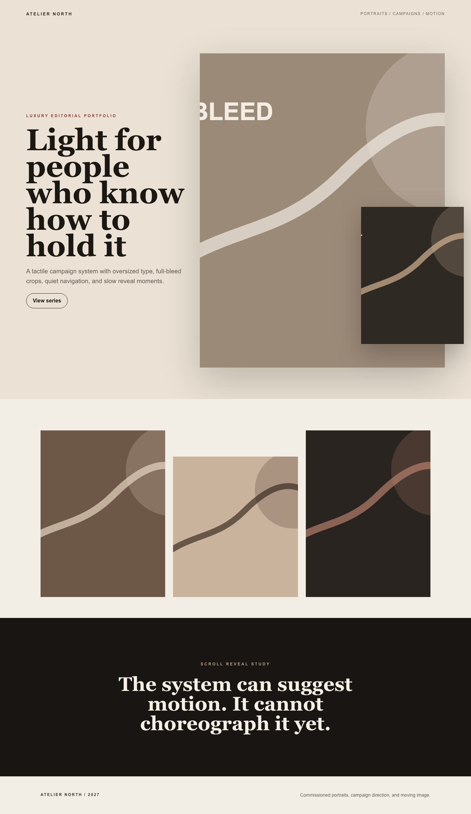
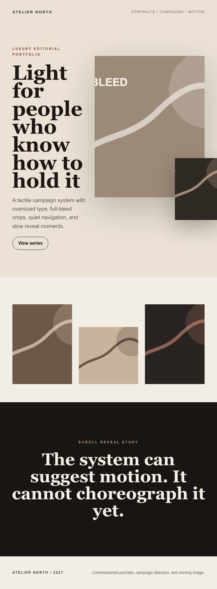
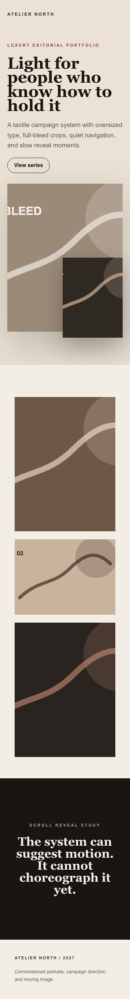

# Editorial Photography Portfolio

## Target Description

1. Representative luxury editorial portfolio, not a copy of a specific brand.
2. First viewport needs a quiet nav, asymmetric hero, oversized serif title, and a full-bleed image crop.
3. The composition should support overlap: one crop sitting over another without a card frame.
4. Image grid needs deliberate whitespace rhythm and staggered vertical alignment.
5. Typography needs fine tracking on small labels and display-scale headline contrast.
6. A scroll-reveal section should imply motion without requiring live editor interaction.
7. Footer should stay restrained and editorial, with compact metadata.

## Screenshots

- Desktop: 
- Tablet: 
- Mobile: 

## Scores

PROVISIONAL - needs human visual verification.

| Axis | Score | Evidence |
|---|---:|---|
| Layout accuracy | 3.5 | Hero, overlap, grid, reveal band, and footer render at all breakpoints; overlap needs absolute offsets and the hero crop is not truly art-directed. |
| Typography | 3.0 | Oversized serif hierarchy and tracked labels are possible with system fonts; target display-font loading is absent. |
| Color and surface | 3.5 | Warm editorial palette and dark reveal band are close; richer film grain, duotone overlays, and multi-layer texture are not authorable cleanly. |
| Spacing rhythm | 3.0 | Large section rhythm is present, but many values are manually tuned and fragile across breakpoints. |
| Responsive behavior | 3.0 | Tablet/mobile collapse works and preserves content order; overlap and stagger are simplified on mobile. |
| Interaction and motion | 2.0 | Scroll-triggered entrance preset exists, but no precise reveal choreography, stagger, parallax, or timeline control. |
| Asset handling | 2.5 | Deterministic inline SVG placeholders are stable; real portfolio work needs media library, focal-point, srcset, and custom crops. |
| Total | 60.0 / 100 | `(21.0 * 20 / 7)` |

## Gap Backlog

CAN'T:

- [Track B, section 11 Capability] Custom display fonts cannot be loaded, so a faithful editorial brand voice cannot be matched beyond system serif approximations.
- [Track B, section 11 Capability] No video node for motion-forward portfolio hero/reel sections.
- [Track B, section 11 Capability] No true multi-background/layer stack; grain, duotone overlays, and image+gradient texture require brittle single-value `backgroundImage` strings.
- [Track B, section 11 Capability] No container queries; responsive behavior is viewport-only, so nested editorial modules cannot adapt to their own width.
- [Track D, section 11 Content workflows] No media library workflow with reusable crops, focal metadata, or responsive sources for a real photography portfolio.
- [Track C, section 11 Editor UX] No first-class overlap/group controls; absolute offsets can render overlap, but a human editor cannot reliably manipulate it as a designed layer.

PAINFUL:

- [Track C, section 11 Editor UX] Overlap required relative/absolute positioning and manual negative/right/bottom offsets. What would make it easy: layer/group controls with drag handles and z-index management.
- [Track C, section 11 Editor UX] Staggered grid rhythm required per-node `marginTopFree` and manual mobile reset. What would make it easy: grid item alignment presets and per-breakpoint rhythm controls.
- [Track C, section 11 Editor UX] Small caps/tracking/display scale required raw typography values on every node. What would make it easy: reusable type styles or global text tokens in the inspector.
- [Track D, section 11 Content workflows] Repeating image-grid items are hand-authored nodes. What would make it easy: authorable repeaters tied to a collection or media set.
- [Track E, section 11 Perf and reliability] Motion is hard to prove from static screenshots. What would make it easy: a motion snapshot mode or deterministic state capture for before/after reveal positions.

## Needs Human Eyes

- Whether the hero crop and overlapped crop feel premium enough or too placeholder-like.
- Whether the oversized serif headline should score higher despite using system fonts only.
- Whether mobile simplification of the overlap is acceptable for the target portfolio class.
- Whether the scroll-reveal section should be judged on rendered presence or actual choreography.
