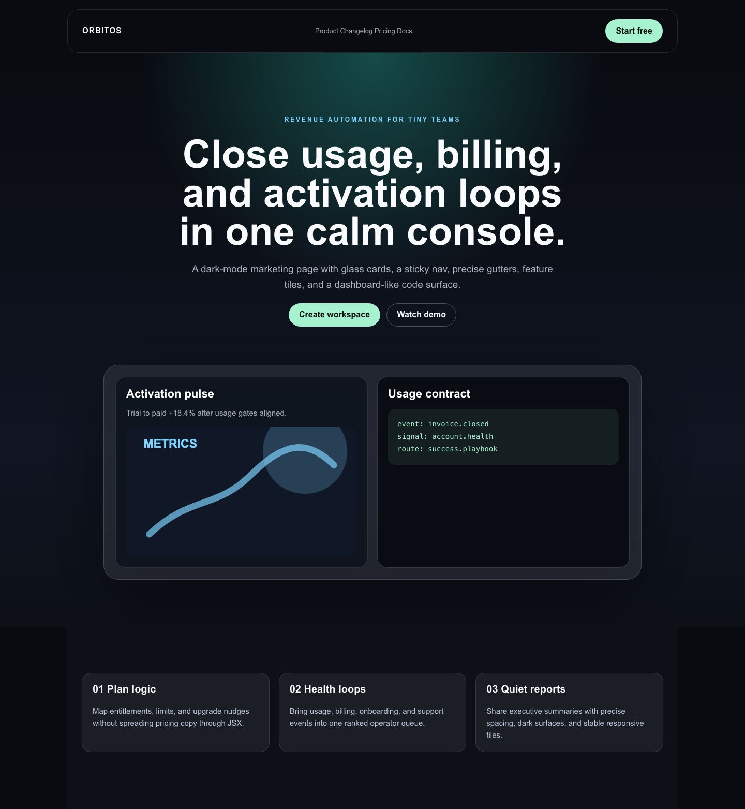
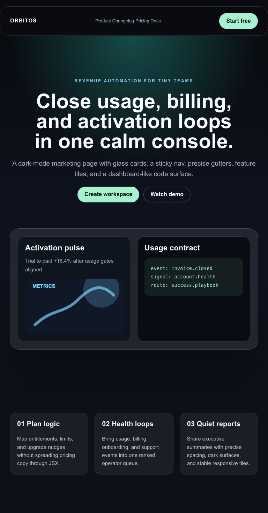
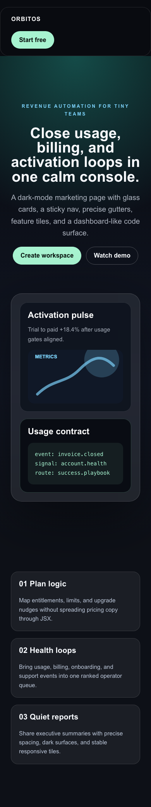

# SaaS Marketing Landing

## Target Description

1. Representative Linear/Stripe-class SaaS landing page, not a copy of a specific brand.
2. First viewport needs sticky dark nav, glass surface treatment, precise center hero, and sharp CTA contrast.
3. Hero should use layered gradients and a dashboard-like product panel.
4. Feature grid should read as dense, quiet, and high-trust rather than decorative marketing cards.
5. Dark-mode surfaces need controlled border, blur, shadow, and text contrast.
6. Landing needs a code/technical proof block and small icon-like feature labels.
7. Mobile should preserve the sales hierarchy without clipping the nav or cards.

## Screenshots

- Desktop: 
- Tablet: 
- Mobile: 

## Scores

PROVISIONAL - needs human visual verification.

| Axis | Score | Evidence |
|---|---:|---|
| Layout accuracy | 3.5 | Sticky nav, centered hero, glass dashboard panel, and feature grid are present; lacks product-specific micro-layout density and real nav semantics. |
| Typography | 3.0 | Bold system sans hierarchy is stable; exact SaaS brand fonts and tighter optical type tuning are unavailable. |
| Color and surface | 4.0 | Dark mode, gradient, glass, border, and shadow surfaces render convincingly with current escapes. |
| Spacing rhythm | 3.5 | Desktop and mobile cadence mostly holds; gutters and card internals are still manual. |
| Responsive behavior | 3.5 | Mobile stacks cleanly and preserves hierarchy; nav links are hidden rather than becoming a real menu. |
| Interaction and motion | 2.0 | Sticky positioning and button states exist; no menu behavior, scroll progress, animated product charts, or transition choreography. |
| Asset handling | 2.5 | Inline SVG chart is stable; real product imagery would need managed media, responsive crops, and possibly embeds. |
| Total | 62.9 / 100 | `(22.0 * 20 / 7)` |

## Gap Backlog

CAN'T:

- [Track B, section 11 Capability] No icon node, so feature labels use text prefixes instead of real scalable icons.
- [Track B, section 11 Capability] No code node; the technical proof block is a paragraph with monospace styling and `whiteSpace`, not semantic code with syntax treatment.
- [Track B, section 11 Capability] No embed node for product demos, changelog widgets, or interactive proof modules.
- [Track B, section 11 Capability] No custom font loading; modern SaaS identities often depend on a specific grotesk or mono.
- [Track B, section 11 Capability] No transition property controls beyond raw style escapes; polished hover/product-card motion is not first-class.
- [Track C, section 11 Editor UX] Sticky nav can render with raw `position: sticky`, but there is no page-level nav/menu primitive or mobile menu behavior.

PAINFUL:

- [Track C, section 11 Editor UX] Glassmorphism required many raw surface values per card. What would make it easy: surface presets for glass, raised, outline, and dark-panel states.
- [Track C, section 11 Editor UX] The dashboard panel required nested cards and manual internal padding. What would make it easy: group/multi-select and align/distribute controls.
- [Track D, section 11 Content workflows] Feature cards are manually duplicated. What would make it easy: repeaters backed by a feature-list collection or local data set.
- [Track D, section 11 Content workflows] Code/proof content is unstructured text. What would make it easy: field-level bindings and typed content blocks for snippets, metrics, and changelog rows.
- [Track E, section 11 Perf and reliability] Visual regression proves final pixels but not sticky behavior after scroll. What would make it easy: an additional scroll-state screenshot in the fidelity harness.
- [Track C, section 11 Editor UX] Mobile nav hides links instead of transforming to a menu. What would make it easy: responsive visibility paired with a real menu/disclosure primitive.

## Needs Human Eyes

- Whether the dark/glass treatment is close enough to the target class or too generic.
- Whether hiding nav links on mobile is acceptable for P1 scoring or should be penalized harder.
- Whether the fake code block should count as a capability gap or only an authoring pain until a code node ships.
- Whether the dashboard mock needs real product density before Phase 2 prioritization.
